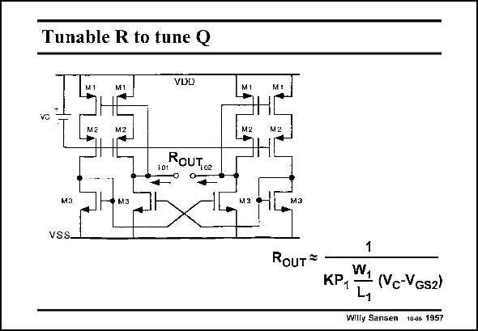

# SANSEN-1957 · Tunable R to tune Q

章节：19 连续时间滤波器  
PDF 页：584；书本页：595；幻灯片编号：1957  
状态：unreviewed



## 对应教材讲解

### PDF 584 · 书本 595

One example of such a tunable resistor R is shown in this slide. The output resistance R is a floating (or OUT differential) resistance. It is fairly high because is sees a cascode of transistors M1 and M2, with feedback to the gates of M1. The resistance upwards is about 1/g . However, transistors m1 M1 are in the linear region. Their g is therefore m1 KP W1/L V . 1 1 DSsat1 It is tunable by means of control voltage V . Indeed, V is simply V −V . The smaller V , the higher the output C DSsat1 C GS2 C resistance R . Really high values of R are obtained provided transistors M1 and M2 enter OUT OUT the weak inversion region. Downwards it sees the output of a current mirror, with small output conductance. Let us now concentrate on the tuning circuits themselves.

## 公式／性能结论候选摘录

以下为规则截取的原文，尚未逐项判读。

- PDF 584: Their g is therefore m1 KP W1/L V . 1 1 DSsat1 It is tunable by means of control voltage V .

## 曲线结论候选摘录

以下为规则截取的原文，尚未逐项判读。

（未由规则找到；不代表原页没有此类内容。）

## 原文条件与近似候选摘录

以下为规则截取的原文，尚未逐项判读。

- PDF 584: Really high values of R are obtained provided transistors M1 and M2 enter OUT OUT the weak inversion region.

## 幻灯片 OCR（未校正）

```text
Tunable R to tune Q
VDD
M1
vs
M2
M2
101
ROUT,o2
• 0.
ма
vss.
• M3
MI
M2
M3
M2
M3
RouT *
1
KР1
W1 (Vc-VGs2)
Willy Sansen 10-46 1957
```

数学上下标、分数及正负号以原图为准。电路图已保留；未核对的连接不输出成可仿真 netlist。
