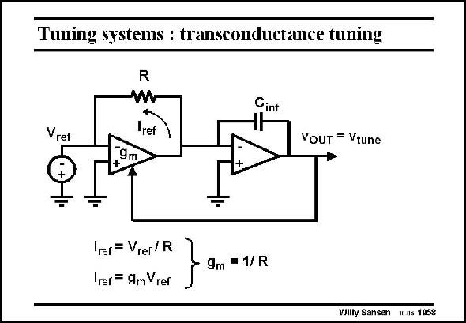

# SANSEN-1958 · Tuning systems : transconductance tuning

章节：19 连续时间滤波器  
PDF 页：584；书本页：595；幻灯片编号：1958  
状态：unreviewed



## 对应教材讲解

### PDF 584 · 书本 595

In order to tune a transconductance g to an external m resistor R, the circuit shown in this slide can be used. The transconductor uses the resistor R in the feedback loop, this is driven by a reference or biasing voltage V . It is followed by an ref integrator, the output of which is the tuning voltage, which adjusts the transconductance g of this m transconductor and of all other transconductor blocks connected to it. The integrator has sufficient gain to determine that its input voltage is always zero. As a result, the transconductance g is adjusted so that it equals 1/R. m Resistors are not readily available, however. Switched capacitors can also be used, as shown next.

## 公式／性能结论候选摘录

以下为规则截取的原文，尚未逐项判读。

- PDF 584: The integrator has sufficient gain to determine that its input voltage is always zero.
- PDF 584: As a result, the transconductance g is adjusted so that it equals 1/R. m Resistors are not readily available, however.

## 曲线结论候选摘录

以下为规则截取的原文，尚未逐项判读。

（未由规则找到；不代表原页没有此类内容。）

## 原文条件与近似候选摘录

以下为规则截取的原文，尚未逐项判读。

（未由规则找到；不代表原页没有此类内容。）

## 幻灯片 OCR（未校正）

```text
Tuning systems : transconductance tuning
R
Cint
Vref
"ref
VouT = Vtune
9m
+
Iref = Vref/ R
Iref = 9m Vref
9m = 1/ R
Willy Sansen 11s 1958
```

数学上下标、分数及正负号以原图为准。电路图已保留；未核对的连接不输出成可仿真 netlist。
