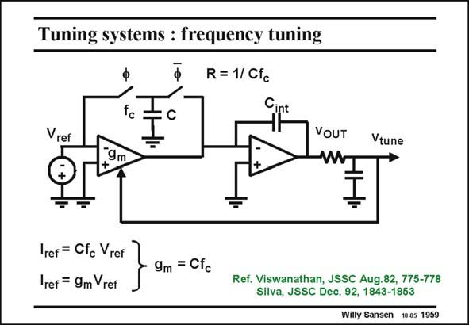

# SANSEN-1959 · Tuning systems : frequency tuning

章节：19 连续时间滤波器  
PDF 页：585；书本页：596；幻灯片编号：1959  
状态：unreviewed



## 对应教材讲解

### PDF 585 · 书本 596

A switched-capacitor resistor R is given by 1/Cf , c in which f is the clock c frequency. As a result, the transconductance g is m adjusted such that it equals Cf . In other words, the time c constant g /C is accurately m locked to the clock frequency, which can be made very accurate indeed (for example with a crystal oscillator). Obviously, some scaling will have to be introduced to be able to separate the filter frequency further from the clock frequency. The required accuracy is achieved, however. Note also, that a low-pass filter is added at the output to suppress the ripple from the clock generator.

## 公式／性能结论候选摘录

以下为规则截取的原文，尚未逐项判读。

- PDF 585: As a result, the transconductance g is m adjusted such that it equals Cf .

## 曲线结论候选摘录

以下为规则截取的原文，尚未逐项判读。

（未由规则找到；不代表原页没有此类内容。）

## 原文条件与近似候选摘录

以下为规则截取的原文，尚未逐项判读。

（未由规则找到；不代表原页没有此类内容。）

## 幻灯片 OCR（未校正）

```text
Tuning systems : frequency tuning
R = 1/ Cfc
fc
C
Vref
,9m
+
VOUT
W
Vtune
I
Iref = Cfc Vref
Iref = 9m Vref
9m = Cfc
Ref. Viswanathan, JSSC Aug.82, 775-778
Silva, JSSC Dec. 92, 1843-1853
Willy Sansen 10.05 1959
```

数学上下标、分数及正负号以原图为准。电路图已保留；未核对的连接不输出成可仿真 netlist。
