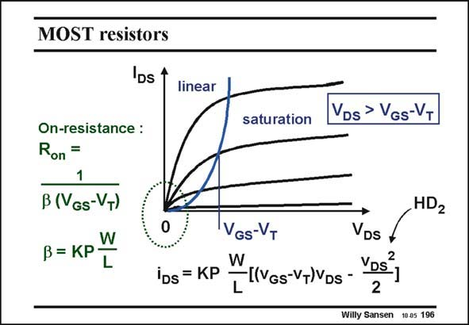

# SANSEN-196 · MOST resistors

章节：19 连续时间滤波器  
PDF 页：558；书本页：569；幻灯片编号：196  
状态：unreviewed



## 对应教材讲解

### PDF 558 · 书本 569

Such an on-resistance is inversely proportional to the Gate voltage. It is very linear provided the V is very small. For DS larger signal-swings however, this is no longer possible and distortion appears. For larger values of V , DS the term in V has to be DS2 included in the I −V DS GS characteristic. This leads to second-order distortion. The easiest way to avoid this distortion is to adopt differential structures. Many configurations are possible.

## 公式／性能结论候选摘录

以下为规则截取的原文，尚未逐项判读。

- PDF 558: Such an on-resistance is inversely proportional to the Gate voltage.

## 曲线结论候选摘录

以下为规则截取的原文，尚未逐项判读。

- PDF 558: For larger values of V , DS the term in V has to be DS2 included in the I −V DS GS characteristic.

## 原文条件与近似候选摘录

以下为规则截取的原文，尚未逐项判读。

- PDF 558: It is very linear provided the V is very small.

## 幻灯片 OCR（未校正）

```text
MOST resistors
DS 1
linear
saturation
VDs > VGs-VT
On-resistance :
Ron =
1
B (VGs-VT)
W
ß = KР•
L
HD2
iDs = KP
VGs-VT
W
[|VGs-V+)VDs -
VDS
VDs*
2
2
1
Willy Sansen 10.05 196
```

数学上下标、分数及正负号以原图为准。电路图已保留；未核对的连接不输出成可仿真 netlist。
