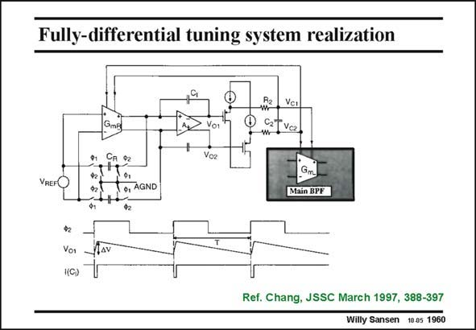

# SANSEN-1960 · Fully-differential tuning system realization

章节：19 连续时间滤波器  
PDF 页：585；书本页：596；幻灯片编号：1960  
状态：unreviewed



## 对应教材讲解

### PDF 585 · 书本 596

An example of such a tuning system is shown in this slide. The Gm block to be tuned is G . It is matched to all mR other Gm blocks in the Bandpass Filter. The switched-capacitor resistor with capacitor C is R a better version than the one on the previous slide, as it is less sensitive to parasitic capacitances. Everything is fully differential to be insensitive to disturbances on the ground and supply lines. This system used a clock of 1.5 MHz to tune filter frequencies between 150 and 800 kHz. These frequencies are still quite close, however. Indeed the capacitance C must be close to the R capacitances used in the BPF for good matching. A technique to separate the clock frequency from the filter frequencies is shown next.

## 公式／性能结论候选摘录

以下为规则截取的原文，尚未逐项判读。

（未由规则找到；不代表原页没有此类内容。）

## 曲线结论候选摘录

以下为规则截取的原文，尚未逐项判读。

（未由规则找到；不代表原页没有此类内容。）

## 原文条件与近似候选摘录

以下为规则截取的原文，尚未逐项判读。

（未由规则找到；不代表原页没有此类内容。）

## 幻灯片 OCR（未校正）

```text
Fully-differential tuning system realization
Vc1
CTva
CA 92
o, AGND
Main BPE
Vor
1(C)
Ref. Chang, JSSC March 1997, 388-397
Willy Sansen 10.05 1960
```

数学上下标、分数及正负号以原图为准。电路图已保留；未核对的连接不输出成可仿真 netlist。
