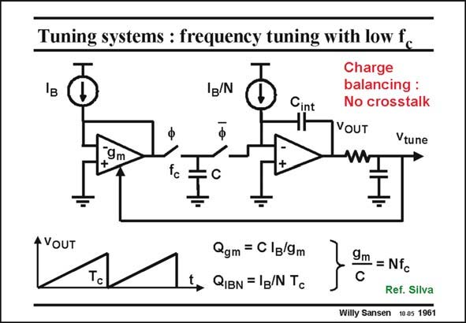

# SANSEN-1961 · Tuning systems : frequency tuning with low fc

章节：19 连续时间滤波器  
PDF 页：586；书本页：597；幻灯片编号：1961  
状态：unreviewed



## 对应教材讲解

### PDF 586 · 书本 597

In order to lower the clock frequency, compared to the filter frequency, the circuit in the slide can be used. Two DC current sources are used with ratio N. The first one generates a voltage IB/gm across the capacitor C. In the next phase current IB/N discharges the capacitor C to zero. In the steady state condition, the charge introduced in the first phase must equal the charge taken away in the second phase. Charge balancing is achieved by the integrator. As a result, the time constant g /C is accurately locked to the clock frequency f , but different m c by a factor N. The main advantage of such a system is that the clock oscillator frequency can be positioned far away from the filter frequencies, such that it does not leak. Oscillator leakage is also the problem with PLL tuning. Charge balancing is therefore a better technique for tuning.

## 公式／性能结论候选摘录

以下为规则截取的原文，尚未逐项判读。

- PDF 586: In the steady state condition, the charge introduced in the first phase must equal the charge taken away in the second phase.
- PDF 586: As a result, the time constant g /C is accurately locked to the clock frequency f , but different m c by a factor N.
- PDF 586: Charge balancing is therefore a better technique for tuning.

## 曲线结论候选摘录

以下为规则截取的原文，尚未逐项判读。

- PDF 586: In the next phase current IB/N discharges the capacitor C to zero.
- PDF 586: In the steady state condition, the charge introduced in the first phase must equal the charge taken away in the second phase.

## 原文条件与近似候选摘录

以下为规则截取的原文，尚未逐项判读。

（未由规则找到；不代表原页没有此类内容。）

## 幻灯片 OCR（未校正）

```text
Tuning systems : frequency tuning with low fc
Ig/N
Cint
Charge
balancing :
No crosstalk
VOUT
Vtune
9m
+
tc
C
A VOUT
Tc
Qgm = C Ig/9m
QIBN = 1g/N Tc
9m
•= Nfc
Ref. Silva
Willy Sansen 10.05 1961
```

数学上下标、分数及正负号以原图为准。电路图已保留；未核对的连接不输出成可仿真 netlist。
