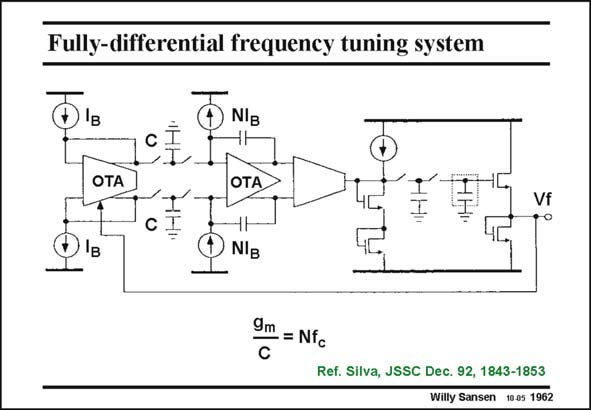

# SANSEN-1962 · Fully-differential frequency tuning system

章节：19 连续时间滤波器  
PDF 页：586；书本页：597；幻灯片编号：1962  
状态：unreviewed



## 对应教材讲解

### PDF 586 · 书本 597

A practical realization of such a tuning system is shown in this slide. It is a differential realization for better rejection of substrate noise. The resistor in the low-pass filter at the output is a switched-capacitor realization as well. This was used for a bandpass filter around 10.7 MHz with N=148, such that the clock is only at 450 kHz. This is far removed from the useful filter frequencies indeed.

## 公式／性能结论候选摘录

以下为规则截取的原文，尚未逐项判读。

（未由规则找到；不代表原页没有此类内容。）

## 曲线结论候选摘录

以下为规则截取的原文，尚未逐项判读。

（未由规则找到；不代表原页没有此类内容。）

## 原文条件与近似候选摘录

以下为规则截取的原文，尚未逐项判读。

（未由规则找到；不代表原页没有此类内容。）

## 幻灯片 OCR（未校正）

```text
Fully-differential frequency tuning system
B
NIB
OTA
OTA
I'
Vf
CI
NIB
9m
-= Nfc
Ref. Silva, JSSC Dec. 92, 1843-1853
Willy Sansen 10.05 1962
```

数学上下标、分数及正负号以原图为准。电路图已保留；未核对的连接不输出成可仿真 netlist。
