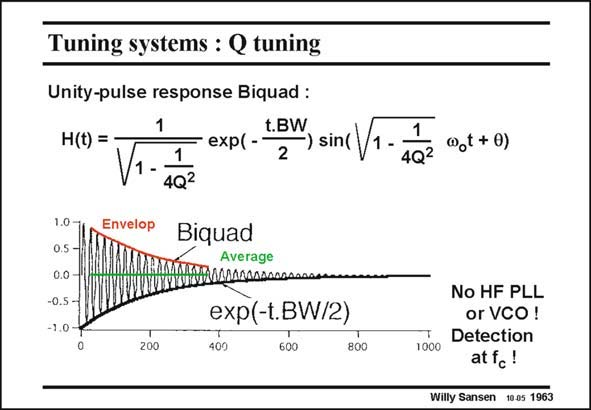

# SANSEN-1963 · Tuning systems : Q tuning

章节：19 连续时间滤波器  
PDF 页：587；书本页：598；幻灯片编号：1963  
状态：unreviewed



## 对应教材讲解

### PDF 587 · 书本 598

Tuning Q is much more complicated and therefore not used very often. As explained before it can be achieved by tuning a resistor which is in parallel with the filter load capacitance C . L The problem is however, how to measure the Q. For this purpose, an underdamped second-order system is realized by means of two Gm blocks. For low Q its response is oscillatory. Both the expression and the response versus time are given in this slide. The oscillatory behavior can be detected by taking the difference between the envelop and the average output signal. The measurement has to be carried out with two different time constants, one which provides the average, and one which takes the envelop.

## 公式／性能结论候选摘录

以下为规则截取的原文，尚未逐项判读。

- PDF 587: Tuning Q is much more complicated and therefore not used very often.

## 曲线结论候选摘录

以下为规则截取的原文，尚未逐项判读。

（未由规则找到；不代表原页没有此类内容。）

## 原文条件与近似候选摘录

以下为规则截取的原文，尚未逐项判读。

（未由规则找到；不代表原页没有此类内容。）

## 幻灯片 OCR（未校正）

```text
Tuning systems : Q tuning
Unity-pulse response Biquad :
1
H(t) = •
V1.-
1
t.BW
• exp( -
-) sin(
2
4Q2
1.0-
0.5
Envelop
Biquad
Average
0.0
-0.5 -
-1.0
200
exp(-t.BW/2)
409
600
800
1
4Q2
@t+0)
No HF PLL
or VCO!
Detection
1000
atfc!
Willy Sansen 1005 1963
```

数学上下标、分数及正负号以原图为准。电路图已保留；未核对的连接不输出成可仿真 netlist。
