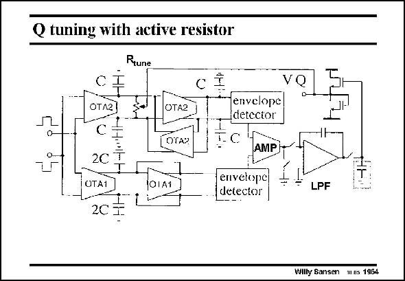

# SANSEN-1964 · Q tuning with active resistor

章节：19 连续时间滤波器  
PDF 页：587；书本页：598；幻灯片编号：1964  
状态：unreviewed



## 对应教材讲解

### PDF 587 · 书本 598

In this realization, two paths lead to the differential amplifier AMP and lowpass filter LPF at the output. The top one has an oscillatory behavior because of low Q. The bottom one has a Q close to unity, which gives a flat response. This difference is amplified and fed back over a low-pass filter to the tunable resistance R . tune

## 公式／性能结论候选摘录

以下为规则截取的原文，尚未逐项判读。

（未由规则找到；不代表原页没有此类内容。）

## 曲线结论候选摘录

以下为规则截取的原文，尚未逐项判读。

（未由规则找到；不代表原页没有此类内容。）

## 原文条件与近似候选摘录

以下为规则截取的原文，尚未逐项判读。

（未由规则找到；不代表原页没有此类内容。）

## 幻灯片 OCR（未校正）

```text
Q tuning with active resistor
Rtune
OTA2]
OTA2 ]
(DTA)
0-
OTA1
OIAT
VQ
D-
envelope
(detector
AMP|
envelope
detector
LPF
Wilty Sansen wus 1964
```

数学上下标、分数及正负号以原图为准。电路图已保留；未核对的连接不输出成可仿真 netlist。
