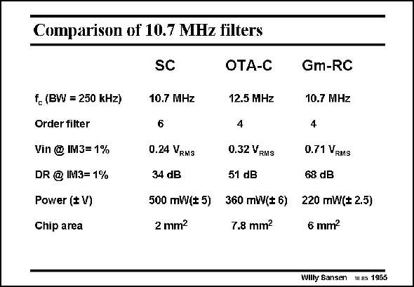

# SANSEN-1965 · Comparison of 10.7 MHz filters

章节：19 连续时间滤波器  
PDF 页：588；书本页：599；幻灯片编号：1965  
状态：unreviewed



## 对应教材讲解

### PDF 587 · 书本 598

For sake of comparison, three realizations for the same application are listed. They all aim at an IF filter for FM. The center frequency is 10.7 MHz and the passband is about 250 kHz. The first is realized by a switched-capacitor techniques, the second uses RC components around opamps and the third uses Gm blocks such as differential pairs, capacitors and tunable resistors. It is clear that the first two realizations suffer from insufficient gain at this fairly high frequency.

### PDF 588 · 书本 599

As a result, the distortion increases and the dynamic range decreases. This is especially true for the SC realization, where the DR suffers from clock injection and charge redistribution. Moreover, the power consumption of the Gm-RC realization is better as simple differential pairs provide much better performance at high frequencies than full operational amplifiers. It can be concluded that from 10 MHz on Gm-C and Gm-RC filters are the best choice. A more elaborate comparison follows at the end of this Chapter.

## 公式／性能结论候选摘录

以下为规则截取的原文，尚未逐项判读。

- PDF 587: It is clear that the first two realizations suffer from insufficient gain at this fairly high frequency.
- PDF 588: As a result, the distortion increases and the dynamic range decreases.

## 曲线结论候选摘录

以下为规则截取的原文，尚未逐项判读。

（未由规则找到；不代表原页没有此类内容。）

## 原文条件与近似候选摘录

以下为规则截取的原文，尚未逐项判读。

（未由规则找到；不代表原页没有此类内容。）

## 幻灯片 OCR（未校正）

```text
Comparison of 10.7 MHz filters
f, (BW = 250 kHz)
Order filter
Vin @ IM3= 1%
DR @ IM3= 1%
Power ($V)
Chip area
SC
OTA-C
Gm-RC
10.7 MHz
6
12.5 MHz
10.7 MHz
4
4
0.24 VRMS
0.32 VRMS
0.71 VRMS
34 dB
51 dB
68 dB
500 mW(*5)
360 mW(# 6) 220 mW($ 2.5)
2 mm?
7.8 mm?
6 mm?
Willty Sansen 1ans 1965
```

数学上下标、分数及正负号以原图为准。电路图已保留；未核对的连接不输出成可仿真 netlist。
