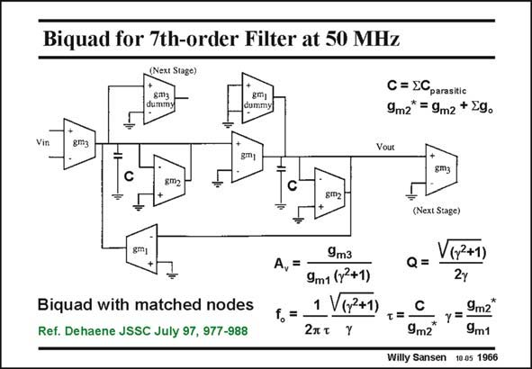

# SANSEN-1966 · Biquad for 7th-order Filter at 50 MHz Next Stage)

章节：19 连续时间滤波器  
PDF 页：588；书本页：599；幻灯片编号：1966  
状态：unreviewed



## 对应教材讲解

### PDF 588 · 书本 599

As a final example of frequency and Q tuning, a 7th order filter is discussed consisting of three biquads and one first-order section. Such a biquad is shown in this slide. Its goal is accurate frequency and phase behavior at high frequencies (here 50 MHz). In order to increase the parasitic pole frequencies as much as possible, no capacitances have been added. The node capacitance C consists of the sum of all parasitic node capacitances. In order to make sure that capacitance C is the same on both nodes, two dummy g blocks are added. m Each node now sees three input capacitances (of blocks g , g and g ) and three output m1 m2 m3 capacitances (also of blocks g , g and g ). m1 m2 m3 For high frequency performance, the g blocks consist of full-differential pairs with local m CMFB. They have large V −V values (0.5 V) for low distortion. GS T The gain A , the characteristic frequency f and Q are readily obtained. Note that g * also v o m2 includes the output conductances. The Q factor can be tuned by tuning factor c, which is a ratio of two transconductances. The frequency f can be tuned by tuning the time constant t. o Two parameters c and constant t need a tuning system. This is discussed next.

## 公式／性能结论候选摘录

以下为规则截取的原文，尚未逐项判读。

- PDF 588: In order to increase the parasitic pole frequencies as much as possible, no capacitances have been added.
- PDF 588: GS T The gain A , the characteristic frequency f and Q are readily obtained.

## 曲线结论候选摘录

以下为规则截取的原文，尚未逐项判读。

- PDF 588: Its goal is accurate frequency and phase behavior at high frequencies (here 50 MHz).
- PDF 588: GS T The gain A , the characteristic frequency f and Q are readily obtained.

## 原文条件与近似候选摘录

以下为规则截取的原文，尚未逐项判读。

（未由规则找到；不代表原页没有此类内容。）

## 幻灯片 OCR（未校正）

```text
Biquad for 7th-order Filter at 50 MHz
Next Stage)
8ma
dummy
C = ECparasitic
9m2* = 9m2 + [g.
Vin
gm3
Vout
C
Sm2
(Next Stage)
V(y2+1)
Biquad with matched nodes
Ref. Dehaene JSSC July 97, 977-988
9m3
A,=
9m1 (r2+1)
1 V(7+1)
f.=
2AT Y
Q=
T =
C
9m2
9m2"
9m1
Willy Sansen 10.05 1966
```

数学上下标、分数及正负号以原图为准。电路图已保留；未核对的连接不输出成可仿真 netlist。
