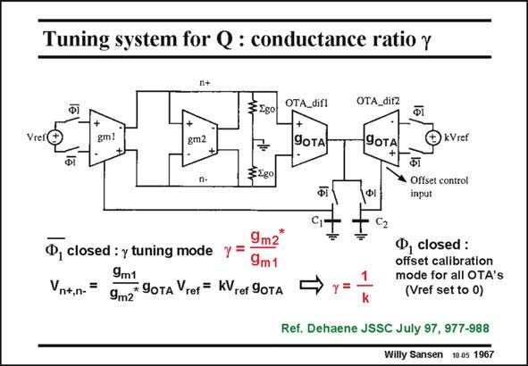

# SANSEN-1967 · Tuning system for Q : conductance ratio y

章节：19 连续时间滤波器  
PDF 页：589；书本页：600；幻灯片编号：1967  
状态：unreviewed



## 对应教材讲解

### PDF 589 · 书本 600

This tuning system has inputs V and kV . Ratio ref ref k is very accurate as it is set by resistor ratios (not shown). Its output is the current control of transconductor g , which is also m1 used for all other filter transconductors. When all switches W 1 dash are closed, the input voltage V to the n+,n- OTA_dif1 is 2V g /g *, ref m1 m2 which is actually 2V /c. ref The input voltage to the OTA_dif2 is 2kV . Both ref voltages experience the same amplification as amplifiers OTA_dif1 and OTA_dif2 have the same gain g . The difference is amplified and stored on capacitor C , which closes the feedback OTA 1 loop and adjusts g such that this difference is zero. As a result, parameter c equals 1/k. It is m1 set accurately by the value given to k. For higher accuracy, an offset calibration cycle is introduced. For this purpose, the switches W dash are open and switch W is closed. The offset error voltage is stored on capacitor C and 1 1 2 subtracted in the other phase.

## 公式／性能结论候选摘录

以下为规则截取的原文，尚未逐项判读。

- PDF 589: Both ref voltages experience the same amplification as amplifiers OTA_dif1 and OTA_dif2 have the same gain g .
- PDF 589: As a result, parameter c equals 1/k.

## 曲线结论候选摘录

以下为规则截取的原文，尚未逐项判读。

- PDF 589: The offset error voltage is stored on capacitor C and 1 1 2 subtracted in the other phase.

## 原文条件与近似候选摘录

以下为规则截取的原文，尚未逐项判读。

（未由规则找到；不代表原页没有此类内容。）

## 幻灯片 OCR（未校正）

```text
Tuning system for Q : conductance ratio y
§580
gm2
OTA_dif1
9OTA
OTA_dif2
ФІ
9OTA
+
kVref
n-
3580
Фі
• Offset control
input
•, closed : y tuning mode y =
9m2
9m1
Vn+,n-
=
9m1
9m2 JoTA ref = KUrer SoTA
Ф, closed :
offset calibration
mode for all OTA's
(Vref setto 0)
Ref. Dehaene JSSC July 97, 977-988
Willy Sansen 10.05 1967
```

数学上下标、分数及正负号以原图为准。电路图已保留；未核对的连接不输出成可仿真 netlist。
