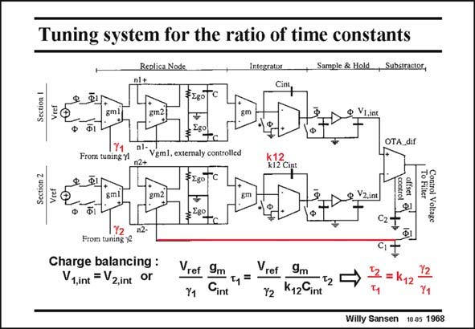

# SANSEN-1968 · Tuning system for the ratio of time constants Sample & Hold →, Substractor,

章节：19 连续时间滤波器  
PDF 页：589；书本页：600；幻灯片编号：1968  
状态：unreviewed



## 对应教材讲解

### PDF 589 · 书本 600

The system to tune the time constants is shown in this slide. Actually, it does not tune the absolute value of one single time constant but rather a ratio of time constants. Indeed, for a higherorder filter, the ratio of characteristic frequencies must be more accurate than the absolute value of one single time constant. The ratio of time constants t and t will be 1 2 locked to the ratio of c values, which have been tuned by circuits as on a previous slide, and a constant k12, which is the ratio of the two integrating capacitors. Again, a charge balancing feedback circuit is used with capacitor C to make the input of the 1 differential amplifier OTA_dif zero. Again, an offset calibration cycle is added, using capacitor C . 2

### PDF 590 · 书本 601

The two voltages at the input of the OTA_dif are provided by two matched circuits, both are driven by V but with different integration capacitors. The one at the top has C whereas the ref int one at the bottom has k12C . int The voltage at the output of the first g block on top is V . It is actually 2V /c . This m1 n1+,n1– ref 1 voltage is integrated over time t . As a result, the input voltage V equals the expression given 1 1,int in this slide. In the same way, the voltage V is derived for the block at the bottom. The 2,int equation of both, as a result of the feedback loop, shows that indeed the ratio of the time constants is kept constant. Despite the tuning circuits, the total power consumption of this CMOS realization is quite low. Moreover, no external trimming is required.

## 公式／性能结论候选摘录

以下为规则截取的原文，尚未逐项判读。

- PDF 590: As a result, the input voltage V equals the expression given 1 1,int in this slide.
- PDF 590: The 2,int equation of both, as a result of the feedback loop, shows that indeed the ratio of the time constants is kept constant.

## 曲线结论候选摘录

以下为规则截取的原文，尚未逐项判读。

- PDF 589: Indeed, for a higherorder filter, the ratio of characteristic frequencies must be more accurate than the absolute value of one single time constant.

## 原文条件与近似候选摘录

以下为规则截取的原文，尚未逐项判读。

- PDF 590: The two voltages at the input of the OTA_dif are provided by two matched circuits, both are driven by V but with different integration capacitors.

## 幻灯片 OCR（未校正）

```text
Tuning system for the ratio of time constants
Replica Nod.
Integrator
Sample & Hold
→, Substractor,
OTA_dif
From tuning yl
Vgml, externaly controlled
Vcel
From tuning 12
Charge balancing :
V1,int = V2,int
or
Vref
Y1
9m
Cint
ref
9m
Y2
Ky2Cint
12 = K12
12
Y1
Willy Sansen 10.05 1968
```

数学上下标、分数及正负号以原图为准。电路图已保留；未核对的连接不输出成可仿真 netlist。
