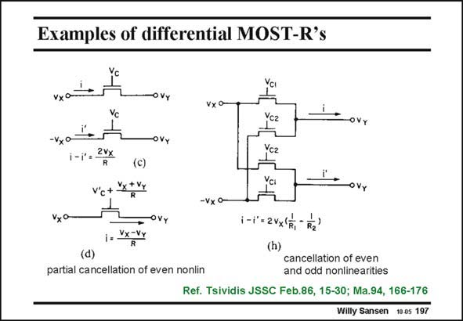

# SANSEN-197 · Examples of differential MOST-R's

章节：19 连续时间滤波器  
PDF 页：559；书本页：570；幻灯片编号：197  
状态：unreviewed



## 对应教材讲解

### PDF 559 · 书本 570

Several examples of MOST resistors are shown in this slide. The differential one (c) allows the cancellation of the even-order distortion. Care must be taken to connect the Bulks to the Sources, which requires extra wells. If this is not possible, additional distortion will be generated. Cancellation of odd-nonlinearities is also possible by addition of cancellation transistors (h), with different sizes and driven by different control voltages V . This is the configuration most often used. c2 It gives higher node capacitances, however. For high frequencies, the two transistor structure (c) may be preferred.

## 公式／性能结论候选摘录

以下为规则截取的原文，尚未逐项判读。

（未由规则找到；不代表原页没有此类内容。）

## 曲线结论候选摘录

以下为规则截取的原文，尚未逐项判读。

（未由规则找到；不代表原页没有此类内容。）

## 原文条件与近似候选摘录

以下为规则截取的原文，尚未逐项判读。

（未由规则找到；不代表原页没有此类内容。）

## 幻灯片 OCR（未校正）

```text
Examples of differential MOST-R's
OVy
Vx0
Ycг
OVY
-Vx°
i-i,2vx
R
(c)
V'c+
Vx +Vy
OVy
-vx o-
Vx°
i.x-Vy
(d)
partial cancellation of even nonlin
i-r = 2vx/F, F2)
(h)
cancellation of even
and odd nonlinearities
Ref. Tsividis JSSC Feb.86, 15-30; Ma.94, 166-176
Willy Sansen 10.05 197
```

数学上下标、分数及正负号以原图为准。电路图已保留；未核对的连接不输出成可仿真 netlist。
