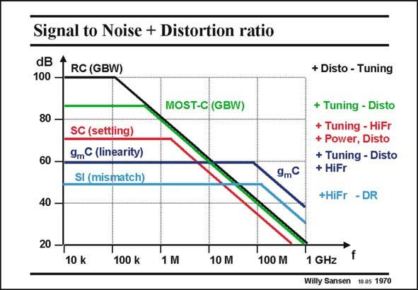

# SANSEN-1970 · Signal to Noise + Distortion ratio

章节：19 连续时间滤波器  
PDF 页：590；书本页：601；幻灯片编号：1970  
状态：unreviewed



## 对应教材讲解

### PDF 590 · 书本 601

In this graph, a first-order comparison is carried out between the different types of filters in terms of dynamic range DR versus frequency. For each type, the DR is sketched versus frequency. The main positive and negative points are listed on the right. At low frequencies, an operational amplifier with RC’s in the feedback loop offers the highest dynamic range. For higher power consumption, even values

### PDF 591 · 书本 602

higher than 100 dB can be reached. The distortion is very low because of the high loop gain. At higher frequencies however, the loop gain decreases and the distortion increases. The DR already decreases at rather low frequencies. Moreover tuning is a problem. Tuning is easy when the resistors are substituted by MOST resistors. The distortion is higher however. The DR can still be as high as 80 dB. Switched-capacitor filters do not easily offer more than about 70 dB dynamic range, because of clock injection and charge distributions. This is even worse at higher frequencies when settling has to be achieved in shorter time. Tunability is good, however. Gm-C filters rarely achieve more than 60 dB because of distortion. They reach the highest frequencies however, because they use the simplest circuit configurations. They can be tuned with dedicated circuitry. Finally, switched-current filters reach nearly the same DR as Gm-C filters and nearly the same high frequencies. Both are lower, however.

## 公式／性能结论候选摘录

以下为规则截取的原文，尚未逐项判读。

- PDF 591: The distortion is very low because of the high loop gain.
- PDF 591: At higher frequencies however, the loop gain decreases and the distortion increases.
- PDF 591: The DR already decreases at rather low frequencies.

## 曲线结论候选摘录

以下为规则截取的原文，尚未逐项判读。

（未由规则找到；不代表原页没有此类内容。）

## 原文条件与近似候选摘录

以下为规则截取的原文，尚未逐项判读。

（未由规则找到；不代表原页没有此类内容。）

## 幻灯片 OCR（未校正）

```text
Signal to Noise + Distortion ratio
dB
100 -
RC (GBW)
+ Disto - Tuning
80 -
MOST-C (GBW)
60 -
SC (settling)
9mC (linearity)
SI (mismatch)
9mC
+ Tuning - Disto
+ Tuning - HiFr
+ Power, Disto
+ Tuning - Disto
+ HiFr
+HiFr - DR
40 -
20 -
f
10 k
100 k
1 M
10 M
100 M
1 GHz
Willy Sansen
10 05 1970
```

数学上下标、分数及正负号以原图为准。电路图已保留；未核对的连接不输出成可仿真 netlist。
