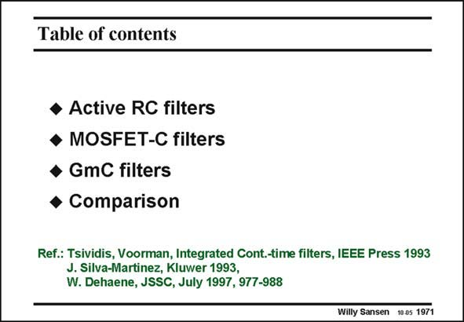

# SANSEN-1971 · Table of contents

章节：19 连续时间滤波器  
PDF 页：591；书本页：602；幻灯片编号：1971  
状态：unreviewed



## 对应教材讲解

### PDF 591 · 书本 602

In this Chapter, continuoustime filters have been discussed. Considerable attention has gone to Gm-C filters as they are capable of a reasonable performance at the higher frequencies. At low frequencies however, OTA-RC filters provide the highest dynamic range. The other types of filters provide a performance in between. This is also true for switchedcapacitor filters. The main disadvantage of Gm-C filters is that they need tuning circuitry and that they give more distortion. For dynamic ranges up to about 60 dB, however, they provide lower power consumption at higher frequencies.

## 公式／性能结论候选摘录

以下为规则截取的原文，尚未逐项判读。

（未由规则找到；不代表原页没有此类内容。）

## 曲线结论候选摘录

以下为规则截取的原文，尚未逐项判读。

（未由规则找到；不代表原页没有此类内容。）

## 原文条件与近似候选摘录

以下为规则截取的原文，尚未逐项判读。

（未由规则找到；不代表原页没有此类内容。）

## 幻灯片 OCR（未校正）

```text
Table of contents
• Active RC filters
• MOSFET-C filters
• GmC filters
• Comparison
Ref.: Tsividis, Voorman, Integrated Cont.-time filters, IEEE Press 1993
J. Silva-Martinez, Kluwer 1993,
W. Dehaene, JSSC, July 1997, 977-988
Willy Sansen 10.05 1971
```

数学上下标、分数及正负号以原图为准。电路图已保留；未核对的连接不输出成可仿真 netlist。
