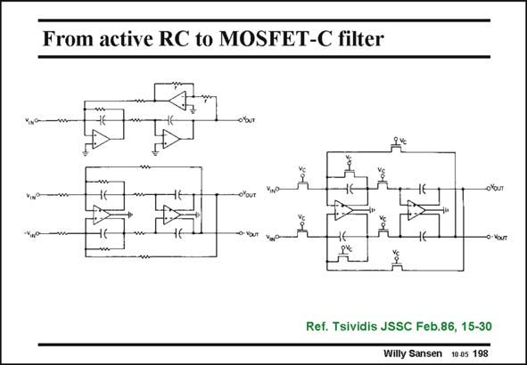

# SANSEN-198 · From active RC to MOSFET-C filter

章节：19 连续时间滤波器  
PDF 页：559；书本页：570；幻灯片编号：198  
状态：unreviewed



## 对应教材讲解

### PDF 559 · 书本 570

An example of a secondorder filter is shown in the left top-corner. It contains two capacitors indeed and three opamps. It is singleended, however. A differential version of the same filter is shown below. One opamp can be left out as it only provides a signal inversion. In a differential circuit both phases are always available. It is sufficient to use two opamps for a second-order filter. However, the opamps are now fully differential. They require common-mode feedback (see Chapter 8), which takes more power. A MOSFET-C realization of the same filter is now shown on the right. All resistors have been replaced by MOSFETs. All their Gates are connected together towards control voltage V . c Tuning of the resistors is thus possible and hence tuning of the filter frequency. A large tuning range also requires a large Voltage range, which may not be easy at low supply voltages. Moreover, MOSFETs have a limited frequency range of operation, as explained next.

## 公式／性能结论候选摘录

以下为规则截取的原文，尚未逐项判读。

- PDF 559: All their Gates are connected together towards control voltage V . c Tuning of the resistors is thus possible and hence tuning of the filter frequency.
- PDF 559: Moreover, MOSFETs have a limited frequency range of operation, as explained next.

## 曲线结论候选摘录

以下为规则截取的原文，尚未逐项判读。

（未由规则找到；不代表原页没有此类内容。）

## 原文条件与近似候选摘录

以下为规则截取的原文，尚未逐项判读。

（未由规则找到；不代表原页没有此类内容。）

## 幻灯片 OCR（未校正）

```text
From active RC to MOSFET-C filter
Ref. Tsividis JSSC Feb.86, 15-30
Willy Sansen 10.05 198
```

数学上下标、分数及正负号以原图为准。电路图已保留；未核对的连接不输出成可仿真 netlist。
