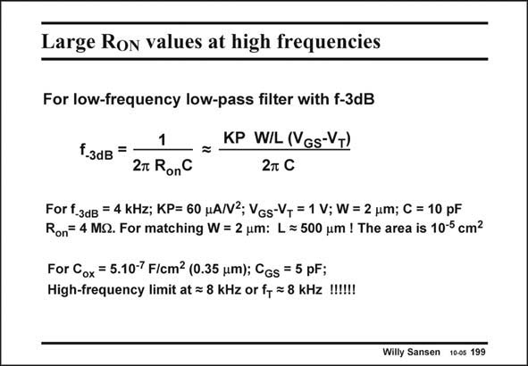

# SANSEN-199 · Large Ron values at high frequencies

章节：19 连续时间滤波器  
PDF 页：560；书本页：571；幻灯片编号：199  
状态：unreviewed



## 对应教材讲解

### PDF 560 · 书本 571

Large values of the onresistance R are required on to realize filters at low frequencies. For example, for a filter at 4 kHz, an R is on required in the MVYs. For matching the smallest dimension, which is W in this case, cannot be much smaller than a few micrometers. As a result, the channel length becomes extremely large, reducing the f to very T low values. The MOST resistor turns into a transmission line with an unpredictable high-frequency characteristics.

## 公式／性能结论候选摘录

以下为规则截取的原文，尚未逐项判读。

- PDF 560: As a result, the channel length becomes extremely large, reducing the f to very T low values.

## 曲线结论候选摘录

以下为规则截取的原文，尚未逐项判读。

- PDF 560: The MOST resistor turns into a transmission line with an unpredictable high-frequency characteristics.

## 原文条件与近似候选摘录

以下为规则截取的原文，尚未逐项判读。

- PDF 560: For matching the smallest dimension, which is W in this case, cannot be much smaller than a few micrometers.

## 幻灯片 OCR（未校正）

```text
Large Ron values at high frequencies
For low-frequency low-pass filter with f-3dB
1
f.зdв = =
2 RonC
=-
KP WIL (VGs-V+)
2т C
For f.3aв = 4 kHz; KP= 60 MA/N2; VGs-V, = 1 V; W = 2 um; C = 10 pF
Ron= 4 MS. For matching W = 2 um: L = 500 um ! The area is 10-5 cm2
For Cox = 5.10-7 F/cm2 (0.35 um); CGs = 5 pF;
High-frequency limit at = 8 kHz or ff ≥ 8 kHz !!!!!!
Willy Sansen 100s 199
```

数学上下标、分数及正负号以原图为准。电路图已保留；未核对的连接不输出成可仿真 netlist。
