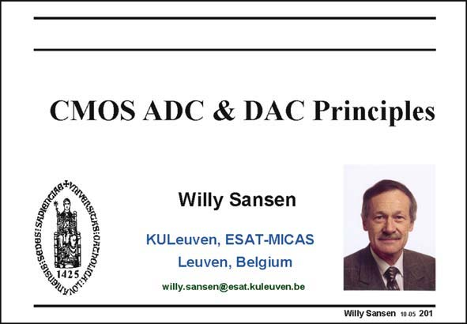

# SANSEN-201 · Slide 201

章节：20 CMOS 模数与数模转换原理  
PDF 页：592；书本页：603；幻灯片编号：201  
状态：unreviewed



## 对应教材讲解

### PDF 592 · 书本 603

An important class of analog circuits are analogto-digital and digital-toanalog converters as they provide the conversion from the analog to digital signals and vice-versa. The number of converter types is legion however, as many different resolutions and speeds are involved. They can thus be classified in terms of resolution and speed capability. This chapter is limited to Nyquist converters. The input signal frequency can reach half the clock frequency. Moreover, each sample is quantized to full precision. In oversampling converters the input signal frequency is much lower than the clock frequency. Also, the precision is obtained as a result of averaging in a feedback loop. These will be discussed in the next Chapter. However, a number of definitions have to be given first.

## 公式／性能结论候选摘录

以下为规则截取的原文，尚未逐项判读。

- PDF 592: They can thus be classified in terms of resolution and speed capability.
- PDF 592: This chapter is limited to Nyquist converters.
- PDF 592: Also, the precision is obtained as a result of averaging in a feedback loop.

## 曲线结论候选摘录

以下为规则截取的原文，尚未逐项判读。

（未由规则找到；不代表原页没有此类内容。）

## 原文条件与近似候选摘录

以下为规则截取的原文，尚未逐项判读。

（未由规则找到；不代表原页没有此类内容。）

## 幻灯片 OCR（未校正）

```text
CMOS ADC & DAC Principles
*O OTEGNENS SRO S 5o
Willy Sansen
KULeuven, ESAT-MICAS
Leuven, Belgium
willy.sansen@esat.kuleuven.be
Willy Sansen 10 as 201
```

数学上下标、分数及正负号以原图为准。电路图已保留；未核对的连接不输出成可仿真 netlist。
