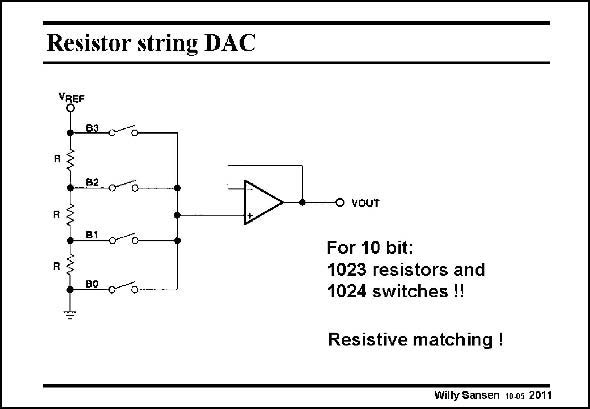

# SANSEN-2011 · Resistor string DAC

章节：20 CMOS 模数与数模转换原理  
PDF 页：597；书本页：608；幻灯片编号：2011  
状态：unreviewed



## 对应教材讲解

### PDF 597 · 书本 608

Possibly the simplest DAC is shown in this slide. It uses a string of equal resistors, which allows all possible voltage fractions of the reference Voltage V REF to be obtained. These fractions are added depending on the switches B and buffered toward the output. It is clear that many resistors are required for high resolution DAC’s of this type. Moreover, matching between the resistors R limits the resolution to 6–8 bit.

## 公式／性能结论候选摘录

以下为规则截取的原文，尚未逐项判读。

- PDF 597: It uses a string of equal resistors, which allows all possible voltage fractions of the reference Voltage V REF to be obtained.
- PDF 597: These fractions are added depending on the switches B and buffered toward the output.
- PDF 597: Moreover, matching between the resistors R limits the resolution to 6–8 bit.

## 曲线结论候选摘录

以下为规则截取的原文，尚未逐项判读。

（未由规则找到；不代表原页没有此类内容。）

## 原文条件与近似候选摘录

以下为规则截取的原文，尚未逐项判读。

（未由规则找到；不代表原页没有此类内容。）

## 幻灯片 OCR（未校正）

```text
Resistor string DAC
VgEF
8R 00
_B2.000..
R
B1
0-0-
B0 0...
O VOUT
For 10 bit:
1023 resistors and
1024 switches !!
Resistive matching !
Willy Sansen 100s 2011
```

数学上下标、分数及正负号以原图为准。电路图已保留；未核对的连接不输出成可仿真 netlist。
