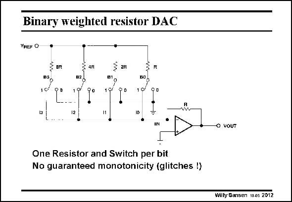

# SANSEN-2012 · Binary weighted resistor DAC

章节：20 CMOS 模数与数模转换原理  
PDF 页：597；书本页：608；幻灯片编号：2012  
状态：unreviewed



## 对应教材讲解

### PDF 597 · 书本 608

Much fewer resistors are required if they are binary weighted. Currents are also added rather than voltages. It is clear that matching plays an important role again. This is a problem as the resistors have widely different values: for a 8 bit converter the largest resistor is 256 times larger than the smallest one. This is remedied by the arrangement on the next slide. The main disadvantage is probably that this converter is prone to glitches. Consider the transition from (B0B1B2B3 =) 0111 to 1000. In the first case, the current flowing into the opamp is 1/8+1/4+1/2=0.875 times V /R. In the other case the current is V /R itself. There is smooth transition expected from REF REF 0.875 to 1 indeed. If however, mismatch is such that 0.875 is higher than 1, then the conversion curve is no longer monotonic. A glitch now occurs!

## 公式／性能结论候选摘录

以下为规则截取的原文，尚未逐项判读。

（未由规则找到；不代表原页没有此类内容。）

## 曲线结论候选摘录

以下为规则截取的原文，尚未逐项判读。

- PDF 597: If however, mismatch is such that 0.875 is higher than 1, then the conversion curve is no longer monotonic.

## 原文条件与近似候选摘录

以下为规则截取的原文，尚未逐项判读。

（未由规则找到；不代表原页没有此类内容。）

## 幻灯片 OCR（未校正）

```text
Binary weighted resistor DAC
VREF O
$ aR
BS
82
B1
101
B0
70
12
11
10
IIN
O VOUT
One Resistor and Switch per bit
No guaranteed monotonicity (glitches !)
Willy Sansen 1003 2012
```

数学上下标、分数及正负号以原图为准。电路图已保留；未核对的连接不输出成可仿真 netlist。
