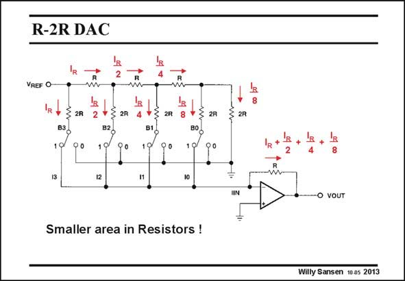

# SANSEN-2013 · R-2R DAC

章节：20 CMOS 模数与数模转换原理  
PDF 页：598；书本页：609；幻灯片编号：2013  
状态：unreviewed



## 对应教材讲解

### PDF 597 · 书本 608

In this DAC only resistors are used of two sizes r and 2R. Actually, all resistors have equal size but for 2R two resistors are put in series. This greatly facilitates the matching between the resistors (see Chapter 15). A resolution of 10 bit is fairly easily achieved.

### PDF 598 · 书本 609

Moreover, the total sum of resistor area is much smaller indeed! To see how this 4-bit converter works, the currents are indicated, through all the branches. The current through the most left resistor 2R, and switch B3, is current I . This R is actually V /2R. This REF current always flows as it is directed by switch B3, either to the input of the opamp (as shown) or to ground. The current through the most left (horizontal) resistor R is also current I . Indeed, it is followed by another resistor 2R through switch B2 in R parallel with another (horizontal) resistor R, which again sees a resistor R. As a result, each (horizontal) resistor R sees a resistance R to the right. At the end of the resistor string, it is clear that the two most right resistors 2R are in parallel and offer a resistance R to the most right (horizontal) resistance. At all nodes, a resistance R is seen to the right with respect to ground. When the switches are in position 1111 (as shown), then all currents are directed into the opamp and through the feedback resistor R towards the output. If a switch is in position 0, then its current flows to ground and does not contribute to the output voltage.

## 公式／性能结论候选摘录

以下为规则截取的原文，尚未逐项判读。

- PDF 597: Actually, all resistors have equal size but for 2R two resistors are put in series.
- PDF 598: As a result, each (horizontal) resistor R sees a resistance R to the right.

## 曲线结论候选摘录

以下为规则截取的原文，尚未逐项判读。

（未由规则找到；不代表原页没有此类内容。）

## 原文条件与近似候选摘录

以下为规则截取的原文，尚未逐项判读。

- PDF 598: Moreover, the total sum of resistor area is much smaller indeed!

## 幻灯片 OCR（未校正）

```text
R-2R DAC
VREF O
w
Z 2R
2R
2R
Smaller area in Resistors !
2R
2R
UN
• vOUT
Willy Sansen 10 as 2013
```

数学上下标、分数及正负号以原图为准。电路图已保留；未核对的连接不输出成可仿真 netlist。
