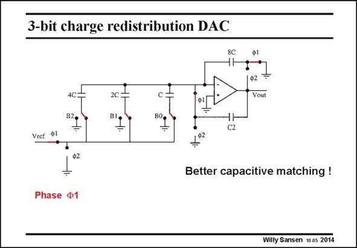

# SANSEN-2014 · 3-bit charge redistribution DAC

章节：20 CMOS 模数与数模转换原理  
PDF 页：598；书本页：609；幻灯片编号：2014  
状态：unreviewed



## 对应教材讲解

### PDF 598 · 书本 609

Nevertheless better matching can be obtained by means of capacitors rather than with transistors. If a resolution of 10 bit can be easily obtained with a resistor bank, then 12 bit can be obtained with a matched capacitor bank (see Chapter 15). An example of such 3-bit capacitor bank is shown in this slide. The larger capacitor 4C consists of 4 equal capacitors C laid out properly (see Chapter 15). By means of charge redistribution, the output voltage is a sum of binary fractions of the reference voltage V . ref In clock phase W1 (as shown) all binary capacitors are charged to V . ref

### PDF 599 · 书本 610

The output voltage holds the voltage obtained during the previous clock phase. In clock phase W2, the charge of the capacitors which belong to the switches connected to ground, is transferred to the output capacitor 8C. The output voltage then changes depending on the charge transferred from these capacitors. Note that this circuit suffers from the same problems as switched capacitors filters. They can easily achieve a 70 dB dynamic range corresponding to about 12 bit, but not much more.

## 公式／性能结论候选摘录

以下为规则截取的原文，尚未逐项判读。

- PDF 598: The larger capacitor 4C consists of 4 equal capacitors C laid out properly (see Chapter 15).
- PDF 599: The output voltage then changes depending on the charge transferred from these capacitors.

## 曲线结论候选摘录

以下为规则截取的原文，尚未逐项判读。

- PDF 598: By means of charge redistribution, the output voltage is a sum of binary fractions of the reference voltage V . ref In clock phase W1 (as shown) all binary capacitors are charged to V . ref
- PDF 599: The output voltage holds the voltage obtained during the previous clock phase.
- PDF 599: In clock phase W2, the charge of the capacitors which belong to the switches connected to ground, is transferred to the output capacitor 8C.

## 原文条件与近似候选摘录

以下为规则截取的原文，尚未逐项判读。

（未由规则找到；不代表原页没有此类内容。）

## 幻灯片 OCR（未校正）

```text
3-bit charge redistribution DAC
•.
4C
B20
Vout
C2
Vref Ф1
Better capacitive matching !
Phase
1
Willy Sansen 10 0s 2014
```

数学上下标、分数及正负号以原图为准。电路图已保留；未核对的连接不输出成可仿真 netlist。
