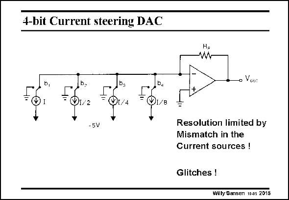

# SANSEN-2015 · 4-bit Current steering DAC

章节：20 CMOS 模数与数模转换原理  
PDF 页：599；书本页：610；幻灯片编号：2015  
状态：unreviewed



## 对应教材讲解

### PDF 599 · 书本 610

Binary currents can also be switched directly as shown in this slide. The binary code determines which currents are added towards the input of the opamp. Now, of course, the mismatch between the binary current sources will play a role. In principle, current sources do not match as well as capacitors. Limited resolution is therefore obtained. Moreover glitches can occur during transitions to higher bits. As this is also a result of mismatch, careful layout will have to be ensured. Glitches can be avoided however, by using a thermometer code rather than a binary code.

## 公式／性能结论候选摘录

以下为规则截取的原文，尚未逐项判读。

- PDF 599: Limited resolution is therefore obtained.

## 曲线结论候选摘录

以下为规则截取的原文，尚未逐项判读。

（未由规则找到；不代表原页没有此类内容。）

## 原文条件与近似候选摘录

以下为规则截取的原文，尚未逐项判读。

（未由规则找到；不代表原页没有此类内容。）

## 幻灯片 OCR（未校正）

```text
4-bit Current steering DAC
1/2
I/B
- 5V
• Voa:
Resolution limited by
Mismatch in the
Current sources !
Glitches !
Willy Sansen 10.05 2015
```

数学上下标、分数及正负号以原图为准。电路图已保留；未核对的连接不输出成可仿真 netlist。
