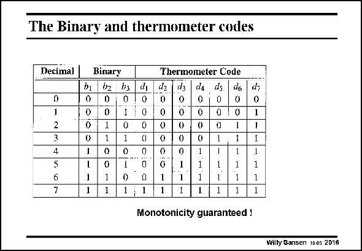

# SANSEN-2016 · The Binary and thermometer codes

章节：20 CMOS 模数与数模转换原理  
PDF 页：599；书本页：610；幻灯片编号：2016  
状态：unreviewed



## 对应教材讲解

### PDF 599 · 书本 610

This table shows the difference. Each time the binary code changes to the next number, the next digital value in the thermometer code goes from 0 to 1. Monotonicity is now guaranteed. Glitches can therefore be avoided. The price to pay however, is the larger number of digital variables. For eight values, only three bits are necessary in the binary code but seven in the thermometer code.

## 公式／性能结论候选摘录

以下为规则截取的原文，尚未逐项判读。

- PDF 599: Glitches can therefore be avoided.

## 曲线结论候选摘录

以下为规则截取的原文，尚未逐项判读。

（未由规则找到；不代表原页没有此类内容。）

## 原文条件与近似候选摘录

以下为规则截取的原文，尚未逐项判读。

（未由规则找到；不代表原页没有此类内容。）

## 幻灯片 OCR（未校正）

```text
The Binary and thermometer codes
Decimal
Binary
bị
0
0
1
2
4
D
1
1
b3
0
1
0
0
7
1
1|
1
0
0
Thermometer Code
0
0
0
1
da
0
0
0
0
0
0
1
1
ds
0
0
0
1
1
1
1
do
0
0
1
1
Monotonicity guaranteed !
d,
0
1
1
1
Wilty Sansen 10.0s 2016
```

数学上下标、分数及正负号以原图为准。电路图已保留；未核对的连接不输出成可仿真 netlist。
