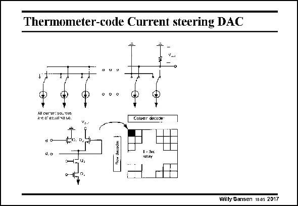

# SANSEN-2017 · Thermometer-code Current steering DAC

章节：20 CMOS 模数与数模转换原理  
PDF 页：600；书本页：611；幻灯片编号：2017  
状态：unreviewed



## 对应教材讲解

### PDF 600 · 书本 611

In this current-steering DAC thermometer code is used for both row and columns. This results in good monotonicity. Current is switched to the output when both the row and column lines for a specific cell are high. These currents add up toward the input of an opamp with a resistor in the feedback loop. Also, simple resistor can be used as shown in this slide. This is especially true for high-frequency realizations where a resistor is 50 V. The switch itself is also shown in this slide. It consists of a differential pair, the current source of which carries the binary current. How can the matching between these transistors Q be improved, will be explained in the next slide. 4 The transistors of the differential pair Q and Q are driven by the digital control signals. 1 2 They are on or off, and conduct the current either to ground or to the output. Note that a cascode transistor Q is used to better isolate the analog current sources (transistors 3 Q ) from the digital switches Q and Q . 4 1 2

## 公式／性能结论候选摘录

以下为规则截取的原文，尚未逐项判读。

（未由规则找到；不代表原页没有此类内容。）

## 曲线结论候选摘录

以下为规则截取的原文，尚未逐项判读。

（未由规则找到；不代表原页没有此类内容。）

## 原文条件与近似候选摘录

以下为规则截取的原文，尚未逐项判读。

（未由规则找到；不代表原页没有此类内容。）

## 幻灯片 OCR（未校正）

```text
Thermometer-code Current steering DAC
A colranhhonee
Pre d'ecuat sa bo.
Columr decose"
d. o
Willy Sansen 10.05 2017
```

数学上下标、分数及正负号以原图为准。电路图已保留；未核对的连接不输出成可仿真 netlist。
