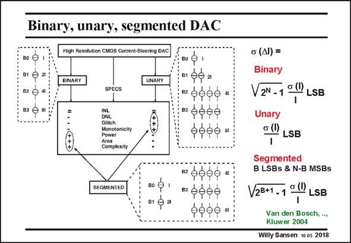

# SANSEN-2018 · Binary, unary, segmented DAC

章节：20 CMOS 模数与数模转换原理  
PDF 页：600；书本页：611；幻灯片编号：2018  
状态：unreviewed



## 对应教材讲解

### PDF 600 · 书本 611

The matching of the current sources is now discussed in more detail. In the binary implementation, each bit directly steers a current source with a value that is twice as large as that of the next less significant bit, while in the unary implementation each bit steers a number of unit current sources. Comparing the performance of these two architectures shows that the binary architecture has a larger DNL and glitch energy error, but since this architecture requires no thermometer decoder (as the unary implementation does) it has a lower power and area consumption. A combination of the advantages of the two architectures is found in the segmented architecture. Here the LSBs are implemented in a binary way while the MSBs are implemented in a unary way.

### PDF 601 · 书本 612

As a conclusion, one can state that in CMOS the best architecture to achieve a high update rate and a high linearity is the segmented current steering architecture. In the unary implementation, the DNL error equals about s(I)/I, in which s(I) is the standard deviation on a unary current source. In the binary implementation however, at half-scale transition, 2N−1 unit current sources are switched off. The DNL error is thererfore much larger. For the segmented architecture, the DNL error is in between. How much standard deviation s(I)/I is actually required?

## 公式／性能结论候选摘录

以下为规则截取的原文，尚未逐项判读。

- PDF 601: As a conclusion, one can state that in CMOS the best architecture to achieve a high update rate and a high linearity is the segmented current steering architecture.
- PDF 601: In the unary implementation, the DNL error equals about s(I)/I, in which s(I) is the standard deviation on a unary current source.

## 曲线结论候选摘录

以下为规则截取的原文，尚未逐项判读。

（未由规则找到；不代表原页没有此类内容。）

## 原文条件与近似候选摘录

以下为规则截取的原文，尚未逐项判读。

- PDF 601: The DNL error is thererfore much larger.

## 幻灯片 OCR（未校正）

```text
Binary, unary, segmented DAC
Migh Resolution CMOS Current-Steering DAC
BO
81
B2
B3 0 B
вo p'
в gệa
вфор0"
SPECS
INL
DNL
Glitch
Monotonicity
Power
Complexity
фффф
SEGMENTED
80 0
Brga
ва 0900
•фффé
bó00 a
G (AI) =
Binary
V2N - 1
o (l)
LSB
Unary
G (l)
LSB
Segmented
B LSBs & N-B MSBs
V2B+1-1
o (l)
LSB
Van den Bosch, ..,
Kluwer 2004
Willy Sansen 10 as 2018
```

数学上下标、分数及正负号以原图为准。电路图已保留；未核对的连接不输出成可仿真 netlist。
