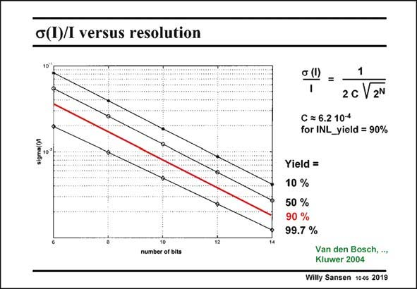

# SANSEN-2019 · c(I)/l versus resolution

章节：20 CMOS 模数与数模转换原理  
PDF 页：601；书本页：612；幻灯片编号：2019  
状态：unreviewed



## 对应教材讲解

### PDF 601 · 书本 612

This standard deviation s(I)/I can be predicted in terms of yield, by means of a fairly complicated function, of which a value is given in this slide. For a 90% yield in INL, the constant C is given in this slide, giving rise to an easy expression, which is plotted in this slide. It shows that for 10 bit resolution, a standard deviation s(I)/I is required of about 0.8% if a yield of 90% is needed. Other values are easily found as well. A standard deviation s(I)/I of 0.8% can easily be achieved in present day CMOS processes. This number will be used to find the sizes of the transistors for the current sources.

## 公式／性能结论候选摘录

以下为规则截取的原文，尚未逐项判读。

（未由规则找到；不代表原页没有此类内容。）

## 曲线结论候选摘录

以下为规则截取的原文，尚未逐项判读。

- PDF 601: For a 90% yield in INL, the constant C is given in this slide, giving rise to an easy expression, which is plotted in this slide.

## 原文条件与近似候选摘录

以下为规则截取的原文，尚未逐项判读。

（未由规则找到；不代表原页没有此类内容。）

## 幻灯片 OCR（未校正）

```text
c(I)/l versus resolution
o (l)
=
1
2c V 2N
С = 6.2 10-4
for INL_yield = 90%
Yield =
10 %
50 %
90 %
99.7 %
number of bits
Van den Bosch, ..,
Kluwer 2004
Willy Sansen 1005 2019
```

数学上下标、分数及正负号以原图为准。电路图已保留；未核对的连接不输出成可仿真 netlist。
