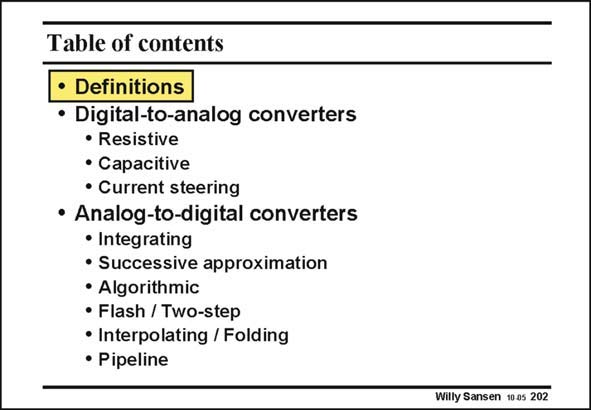

# SANSEN-202 · Table of contents • Definitions

章节：20 CMOS 模数与数模转换原理  
PDF 页：592；书本页：603；幻灯片编号：202  
状态：unreviewed



## 对应教材讲解

### PDF 592 · 书本 603

After the definitions, we will focus on DACs first. The main limitations in DACs are a result of mismatch, either between transistors or between passives as resistors and capacitors. The AD Converters will be discussed. The principles of the more important types will be introduced, followed by some realizations. Considerable attention is paid to the limitations in both speed and resolution.

## 公式／性能结论候选摘录

以下为规则截取的原文，尚未逐项判读。

- PDF 592: The main limitations in DACs are a result of mismatch, either between transistors or between passives as resistors and capacitors.
- PDF 592: Considerable attention is paid to the limitations in both speed and resolution.

## 曲线结论候选摘录

以下为规则截取的原文，尚未逐项判读。

（未由规则找到；不代表原页没有此类内容。）

## 原文条件与近似候选摘录

以下为规则截取的原文，尚未逐项判读。

（未由规则找到；不代表原页没有此类内容。）

## 幻灯片 OCR（未校正）

```text
Table of contents
• Definitions
• Digital-to-analog converters
• Resistive
• Capacitive
• Current steering
• Analog-to-digital converters
• Integrating
• Successive approximation
• Algorithmic
• Flash / Two-step
• Interpolating / Folding
• Pipeline
Willy Sansen 10 0s 202
```

数学上下标、分数及正负号以原图为准。电路图已保留；未核对的连接不输出成可仿真 netlist。
