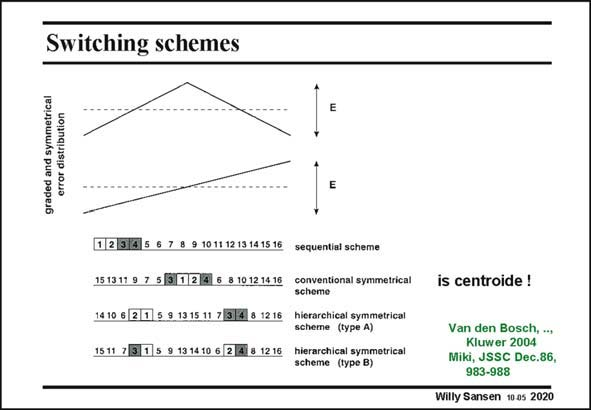

# SANSEN-2020 · Switching schemes

章节：20 CMOS 模数与数模转换原理  
PDF 页：601；书本页：612；幻灯片编号：2020  
状态：unreviewed



## 对应教材讲解

### PDF 601 · 书本 612

Sizing is only one technique to improve the matching. Other layout techniques have been discussed in Chapter 15. For example, centroide layout is of utmost importance to improve the matching. This is shown in this slide, for the switching schemes for the current sources. In general, the error distribution can be modeled by a linear or symmetric gradient E, or a combination of both. A linear gradient is

### PDF 602 · 书本 613

caused by, for example, a variation of oxide thickness or a drop in ground line. A symmetric gradient, on the other hand, can be caused by temperature or packaging stress. The switching schemes show how the digital codes are transformed into decimal values (or thermometer code). Several schemes are compared. In the sequential switching scheme (on top), the current sources in a given row are turned on sequentially from the left to the right. The effect on the INL is given in the next slide. It is clear that this scheme causes large linearity errors due to the accumulation of both graded and symmetrical errors.

## 公式／性能结论候选摘录

以下为规则截取的原文，尚未逐项判读。

（未由规则找到；不代表原页没有此类内容。）

## 曲线结论候选摘录

以下为规则截取的原文，尚未逐项判读。

（未由规则找到；不代表原页没有此类内容。）

## 原文条件与近似候选摘录

以下为规则截取的原文，尚未逐项判读。

（未由规则找到；不代表原页没有此类内容。）

## 幻灯片 OCR（未校正）

```text
Switching schemes
graded and symmetrical
error distribution
1 (2 3/4 5 6 7 8 9 10 11 12 13 14 15 16 sequentisl scheme
15 1311 9 7 5 /3 (1 24 6 8 10 12 14 16 conventional symmetrical
scheme
1410 6 [2 1 5 9 1315 11 7 3|4 8 1216 hicrarchical symmetrical
scheme (type A)
1511 7 (3 1 5 9 13 14 10 6 2 41 8 12 16 hierarchical symmetrical
scheme (type B)
is centroide !
Van den Bosch, ..,
Kluwer 2004
Miki, JSSC Dec.86,
983-988
Willy Sansen 10 as 2020
```

数学上下标、分数及正负号以原图为准。电路图已保留；未核对的连接不输出成可仿真 netlist。
