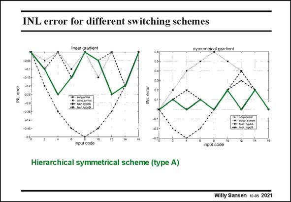

# SANSEN-2021 · INL error for different switching schemes

章节：20 CMOS 模数与数模转换原理  
PDF 页：602；书本页：613；幻灯片编号：2021  
状态：unreviewed



## 对应教材讲解

### PDF 602 · 书本 613

In the conventional symmetrical switching scheme, the current sources are turned on in a symmetrical way around the center of the row. The graded errors are now cancelled at every two increments of the digital input (see left) but the errors generated by a symmetrical gradient will accumulate as indicated on the right. In the hierarchical symmetrical switching scheme, the current sources are turned on around the first and the third quarter of the current sources row. Two different schemes are now possible. In scheme A, the symmetrical error generated by current source 1 is cancelled by current source 2, while the graded error caused by the current source pair (1,2) is cancelled by the current source pair (3,4). In switching scheme B, the errors caused by the linear gradient are cancelled out at current source level while the symmetrical errors are cancelled at the current source pair level. As a result, in type A, the INL error is about the same for both the graded and the symmetrical error distribution whereas in type B, the INL error caused by the symmetrical error distribution is twice as large as the one caused by the graded error distribution. Therefore, the hierarchical symmetrical scheme A has been preferred. It is obvious that such heuristics may not yield optimum results. Optimization algorithms such as the Q2 random walk switching scheme have been used to achieve 14 bit conversion (Ref. Van Der Plas, JSSC Dec. 1999, 1708–1718).

## 公式／性能结论候选摘录

以下为规则截取的原文，尚未逐项判读。

- PDF 602: As a result, in type A, the INL error is about the same for both the graded and the symmetrical error distribution whereas in type B, the INL error caused by the symmetrical error distribution is twice as large as the one caused by the graded error distribution.
- PDF 602: Therefore, the hierarchical symmetrical scheme A has been preferred.

## 曲线结论候选摘录

以下为规则截取的原文，尚未逐项判读。

（未由规则找到；不代表原页没有此类内容。）

## 原文条件与近似候选摘录

以下为规则截取的原文，尚未逐项判读。

（未由规则找到；不代表原页没有此类内容。）

## 幻灯片 OCR（未校正）

```text
INL error for different switching schemes
symmetrical gradient
NL errot
INL error
input code
Hierarchical symmetrical scheme (type A)
Willy Sansen 10 as 2021
```

数学上下标、分数及正负号以原图为准。电路图已保留；未核对的连接不输出成可仿真 netlist。
