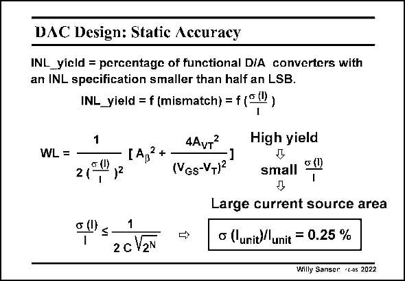

# SANSEN-2022 · DAC Design: Static Accuracy

章节：20 CMOS 模数与数模转换原理  
PDF 页：603；书本页：614；幻灯片编号：2022  
状态：unreviewed



## 对应教材讲解

### PDF 602 · 书本 613

Since two D/A converters that are processed in the same technology do not necessarily have the same specifications due to technological variations, it is of the utmost importance to know the precise relationship that exists between the specifications of the circuit and the matching properties of the used technology.

### PDF 603 · 书本 614

For a current-steering D/A converter, the INL is mainly determined by the matching behavior of the current sources. The parameter that is best suited for expressing this technology versus DAC-specification relation is the INL yield. This INL yield is defined as the ratio of the number of D/A converters with an INL smaller than (cid:1) LSB to the total number of tested D/A converters. The random variations are modeled using a normal distribution with expected value zero and a relative standard deviation s(I)/I. The statistical relationship has been investigated analytically, resulting in an accurate formula expressing directly the relationship between the INL yield specification, the resolution and the relative unit current standard deviation for the D/A converter. This was given before. Note that the gate area of the current sources is inversely proportional to the relative unit current standard deviation. Since a high yield requires a small value for this standard deviation, this directly implies a large current source area. To obtain a 12 bit accuracy, a relative unit current source standard deviation of 0.25% is necessary.

## 公式／性能结论候选摘录

以下为规则截取的原文，尚未逐项判读。

- PDF 603: Note that the gate area of the current sources is inversely proportional to the relative unit current standard deviation.

## 曲线结论候选摘录

以下为规则截取的原文，尚未逐项判读。

（未由规则找到；不代表原页没有此类内容。）

## 原文条件与近似候选摘录

以下为规则截取的原文，尚未逐项判读。

（未由规则找到；不代表原页没有此类内容。）

## 幻灯片 OCR（未校正）

```text
DAC Design: Static Accuracy
INL_yicld = percentagc of functional DIA converters with
an INL specification smaller than half an LSB.
INL_yield = f (mismatch)
• (1)
1
WL =
2(
4AvT
[A,2*
(VGs-VT)2
High yield
Д
small
o (0
0 0≤-
1
2 c V2N
Large current source area
o (lunit)/ unit = 0.25 %
Willy Sanger •Cos 2022
```

数学上下标、分数及正负号以原图为准。电路图已保留；未核对的连接不输出成可仿真 netlist。
