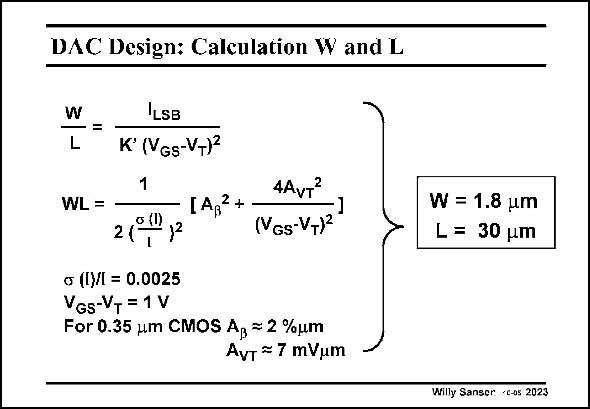

# SANSEN-2023 · DAC Design: Calculation W and L

章节：20 CMOS 模数与数模转换原理  
PDF 页：603；书本页：614；幻灯片编号：2023  
状态：unreviewed



## 对应教材讲解

### PDF 603 · 书本 614

Using the following equations, the dimensions of the current source can be easily found. For a 1V peak-to-peak output voltage over a double terminated (coax)cable, a fullscale current I of 20 mA is FS designed. The current equation is the first equation on the right. The mismatch equation is copied from the previous slide together with the value for the relative unit current standard deviation and the gate overdrive voltage. As a result, the width of the unit current source transistor equals 1.8 mm and its length is 30 mm.

## 公式／性能结论候选摘录

以下为规则截取的原文，尚未逐项判读。

- PDF 603: As a result, the width of the unit current source transistor equals 1.8 mm and its length is 30 mm.

## 曲线结论候选摘录

以下为规则截取的原文，尚未逐项判读。

- PDF 603: For a 1V peak-to-peak output voltage over a double terminated (coax)cable, a fullscale current I of 20 mA is FS designed.

## 原文条件与近似候选摘录

以下为规则截取的原文，尚未逐项判读。

（未由规则找到；不代表原页没有此类内容。）

## 幻灯片 OCR（未校正）

```text
DAC Design: Calculation W and L
—=
L
ILSB
K° (VGs-VT)2
1
WL=
4AVT
IA,2+
(VGs-VT)2
W = 1.8 um
L= 30 um
2 (
с (I)/l = 0.0025
VGs-V+= 1 V
For 0.35 um CMOS Ap = 2 %um
AvT = 7 mVum
Willy Sanger •Cus 2023
```

数学上下标、分数及正负号以原图为准。电路图已保留；未核对的连接不输出成可仿真 netlist。
