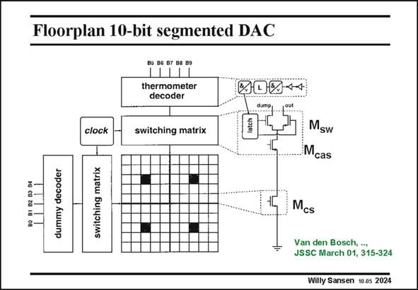

# SANSEN-2024 · Floorplan 10-bit segmented DAC

章节：20 CMOS 模数与数模转换原理  
PDF 页：604；书本页：615；幻灯片编号：2024  
状态：unreviewed



## 对应教材讲解

### PDF 604 · 书本 615

As an example, a realization is discussed of a high-speed 10-bit current steering DAC. At high frequencies, attention has to be paid to the dynamic performance. This suffers from several effects such as – timing errors – capacitive feedthrough from the digital control signals – lack of stability of the Drain voltage of the current source transistors. This latter effect is even more dominant if the output impedances of the current sources are too low. Indeed, switching the transistors M on and off causes the voltage across the current source transistor M to sw cs vary. As a result, the effective resolution is decreased. This is shown in the next slide. Note that this realization consists of 5 bit binary and 5 bit unary sub-DACs. For the five most significant bits, the input bit streams are converted to a 32 bit thermometer code output. For the 5-bit binary LSB processing, the digital outputs are the same as the input. A dummy decoder has been added however, to minimize latency problems between the signals generated by the MSB decoder and the binary LSB bits.

## 公式／性能结论候选摘录

以下为规则截取的原文，尚未逐项判读。

- PDF 604: As a result, the effective resolution is decreased.

## 曲线结论候选摘录

以下为规则截取的原文，尚未逐项判读。

（未由规则找到；不代表原页没有此类内容。）

## 原文条件与近似候选摘录

以下为规则截取的原文，尚未逐项判读。

（未由规则找到；不代表原页没有此类内容。）

## 幻灯片 OCR（未校正）

```text
Floorplan 10-bit segmented DAC
85 B6 87 B8 89
thermometer
decoder
204+4
clock
switching matrix
Msw
Mcas
30 81 82 83 8
dummy decoder
switching matrix
Mcs
Van den Bosch, ..,
JSSC March 01. 315-324
Willy Sansen 10 as 2024
```

数学上下标、分数及正负号以原图为准。电路图已保留；未核对的连接不输出成可仿真 netlist。
