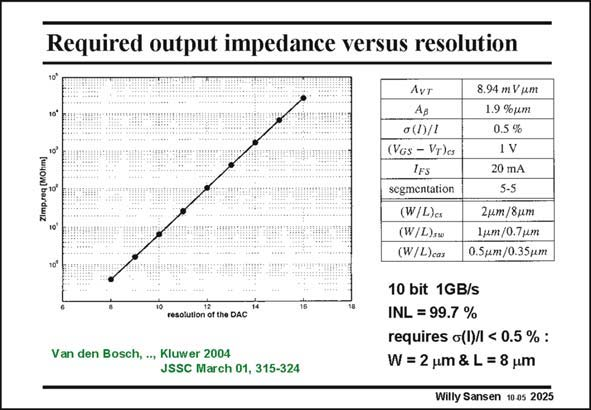

# SANSEN-2025 · Required output impedance versus resolution

章节：20 CMOS 模数与数模转换原理  
PDF 页：604；书本页：615；幻灯片编号：2025  
状态：unreviewed



## 对应教材讲解

### PDF 604 · 书本 615

The output impedance to achieve a specific resolution is shown for a 25 V load. For a resolution of 10 bits, the output impedance must be at least 6.4 MV. For a 12 bits resolution, this must be 100 MV! It is clear that the only way to achieve such a high value is to insert a cascode transistor M between the casc switching pair and the current source. The main characteristic of this cascode transistor is that its output capacitance should be as small as possible. This means that its drain area must be as small as

### PDF 605 · 书本 616

possible. As a result its W/L is made small (2–3) and its V −V is large, as large as 1 V, GS T provided the power supply allows this. To achieve a 99.7% INL, the current source matching must be at least 0.5%. The dimensions of the current source transistor M are then easily calculated. The cascode has been made as cs small as possible in this 0.35 mm CMOS technology.

## 公式／性能结论候选摘录

以下为规则截取的原文，尚未逐项判读。

- PDF 605: As a result its W/L is made small (2–3) and its V −V is large, as large as 1 V, GS T provided the power supply allows this.

## 曲线结论候选摘录

以下为规则截取的原文，尚未逐项判读。

- PDF 604: The main characteristic of this cascode transistor is that its output capacitance should be as small as possible.

## 原文条件与近似候选摘录

以下为规则截取的原文，尚未逐项判读。

- PDF 605: As a result its W/L is made small (2–3) and its V −V is large, as large as 1 V, GS T provided the power supply allows this.

## 幻灯片 OCR（未校正）

```text
Required output impedance versus resolution
10°
Zimpreq (MOtm]
10'
10
resoution of tse DAC
Van den Bosch, .., Kluwer 2004
JSSC March 01, 315-324
Лут
Ap
ơ (1)/1
(VGs - VT)es
lfs
segmentation
(W/L)cs
(W/L)rso
(W/L)cas
8.94 m V um
1.9 %jт
0.5 %
IV
20 mA
5-5
2,m/8um
1gum /0.7 pm
0.5j.m/0.35mm
10 bit 1GB/s
INL = 99.7 %
requires o(l)/ < 0.5 % :
W= 2 um & L = 8 um
Willy Sansen 10 as 2025
```

数学上下标、分数及正负号以原图为准。电路图已保留；未核对的连接不输出成可仿真 netlist。
