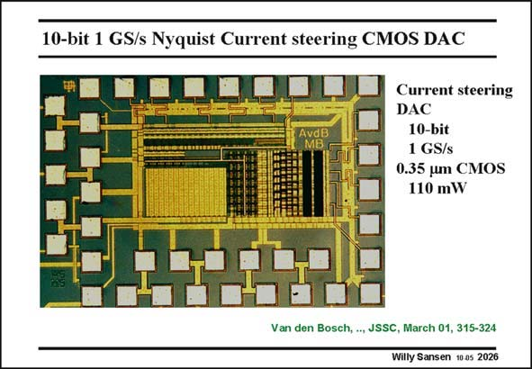

# SANSEN-2026 · 10-bit 1 GS/s Nyquist Current steering CMOS DAC

章节：20 CMOS 模数与数模转换原理  
PDF 页：605；书本页：616；幻灯片编号：2026  
状态：unreviewed



## 对应教材讲解

### PDF 605 · 书本 616

A layout of this realization is shown in this slide. Many blocks have been laid out by hand to reduce the dimensions to a minimum. This also applies to the dummy decoder mentioned previousl. As a result, the dynamic performance is excellent, as shown in the next slide.

## 公式／性能结论候选摘录

以下为规则截取的原文，尚未逐项判读。

- PDF 605: As a result, the dynamic performance is excellent, as shown in the next slide.

## 曲线结论候选摘录

以下为规则截取的原文，尚未逐项判读。

（未由规则找到；不代表原页没有此类内容。）

## 原文条件与近似候选摘录

以下为规则截取的原文，尚未逐项判读。

（未由规则找到；不代表原页没有此类内容。）

## 幻灯片 OCR（未校正）

```text
10-bit 1 GS/s Nyquist Current steering CMOS DAC
Current steering
DAC
10-bit
1 GS/s
0.35 um CMOS
110 mW
Van den Bosch, .., JSSC, March 01, 315-324
Willy Sansen 10 as 2026
```

数学上下标、分数及正负号以原图为准。电路图已保留；未核对的连接不输出成可仿真 netlist。
