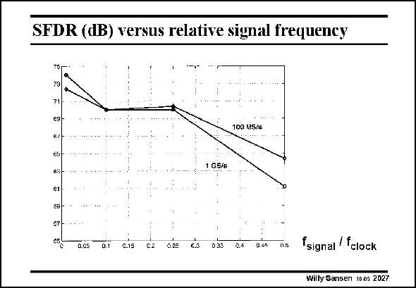

# SANSEN-2027 · SFDR (dB) versus relative signal frequency

章节：20 CMOS 模数与数模转换原理  
PDF 页：605；书本页：616；幻灯片编号：2027  
状态：unreviewed



## 对应教材讲解

### PDF 605 · 书本 616

A single-tone spectrum is shown in this slide. At low frequencies, an effective resolution is obtained of 74 dB or 11.7 bits. For a clock frequency of 1 GHz, the maximum frequency on this plot is 500 MHz. A resolution of 70 dB is still achieved up to 250 MHz signal frequency, which is still about 11.3 bits. At the highest frequency, the SFDR is 61 dB or about 10 bits indeed. At this point the analog part consumes 60 mW and the digital part 62 mW, all from 1.9 V power supply. This is for a 20 mA full-scale current. For a 16 mA full-scale current, the power consumption drops to 110 mW.

## 公式／性能结论候选摘录

以下为规则截取的原文，尚未逐项判读。

（未由规则找到；不代表原页没有此类内容。）

## 曲线结论候选摘录

以下为规则截取的原文，尚未逐项判读。

- PDF 605: For a clock frequency of 1 GHz, the maximum frequency on this plot is 500 MHz.

## 原文条件与近似候选摘录

以下为规则截取的原文，尚未逐项判读。

（未由规则找到；不代表原页没有此类内容。）

## 幻灯片 OCR（未校正）

```text
SFDR (dB) versus relative signal frequency
75
€9-
w/-
65
BX
e1
100 MS/&
1 G5/e
0.05
0.1
C.15
C.a
6.2e
c.s
035
0.4
D 45
N5
fsignal / fclock
Willy Sansen 10.05 2027
```

数学上下标、分数及正负号以原图为准。电路图已保留；未核对的连接不输出成可仿真 netlist。
