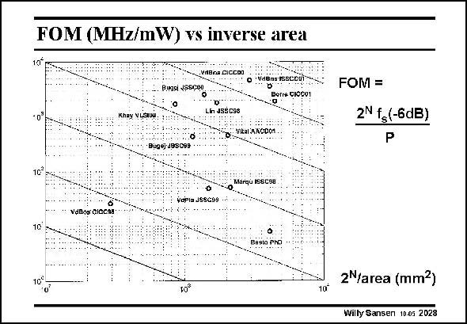

# SANSEN-2028 · FOM (MHz/mW) vs inverse area

章节：20 CMOS 模数与数模转换原理  
PDF 页：606；书本页：617；幻灯片编号：2028  
状态：unreviewed



## 对应教材讲解

### PDF 606 · 书本 617

For comparison, a Figure of Merit has to be devised. This FOM includes the resolution, the maximum signal frequency at which this resolution has been obtained and the power consumption. As it is plotted versus inverse area, it emphasizes the high-frequency performance of this converter.

## 公式／性能结论候选摘录

以下为规则截取的原文，尚未逐项判读。

（未由规则找到；不代表原页没有此类内容。）

## 曲线结论候选摘录

以下为规则截取的原文，尚未逐项判读。

- PDF 606: As it is plotted versus inverse area, it emphasizes the high-frequency performance of this converter.

## 原文条件与近似候选摘录

以下为规则截取的原文，尚未逐项判读。

（未由规则找到；不代表原页没有此类内容。）

## 幻灯片 OCR（未校正）

```text
FOM (MHz/mW) vs inverse area
Bugsi vSSço0
vere ssceu
Borre CI0001
Khay VLSIOK
Lih JSSC3S
O.
VRAL BACDO1,
Buge)-J9SC9s
10"
VoPia JSSG99 ..
VaBos CICCAS
1C
Besto rno
10°
10°
10
FOM =
2N fg(-6dB)
P
2 /area (mm2)
Willy Sansen 10.05 2028
```

数学上下标、分数及正负号以原图为准。电路图已保留；未核对的连接不输出成可仿真 netlist。
