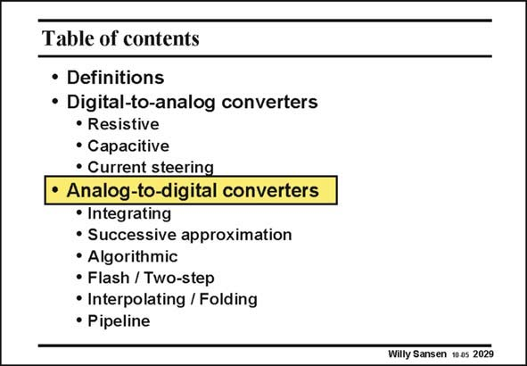

# SANSEN-2029 · Table of contents

章节：20 CMOS 模数与数模转换原理  
PDF 页：606；书本页：617；幻灯片编号：2029  
状态：unreviewed



## 对应教材讲解

### PDF 606 · 书本 617

Now that the most important principles have been discussed of DACs, we look at ADC’s. Again, the most important principles are introduced. They are first of all, compared in terms of resolution and speed.

## 公式／性能结论候选摘录

以下为规则截取的原文，尚未逐项判读。

（未由规则找到；不代表原页没有此类内容。）

## 曲线结论候选摘录

以下为规则截取的原文，尚未逐项判读。

（未由规则找到；不代表原页没有此类内容。）

## 原文条件与近似候选摘录

以下为规则截取的原文，尚未逐项判读。

（未由规则找到；不代表原页没有此类内容。）

## 幻灯片 OCR（未校正）

```text
Table of contents
• Definitions
• Digital-to-analog converters
• Resistive
• Capacitive
• Current steering
• Analog-to-digital converters
• Integrating
• Successive approximation
• Algorithmic
• Flash / Two-step
• Interpolating / Folding
• Pipeline
Willy Sansen 10 0s 2029
```

数学上下标、分数及正负号以原图为准。电路图已保留；未核对的连接不输出成可仿真 netlist。
