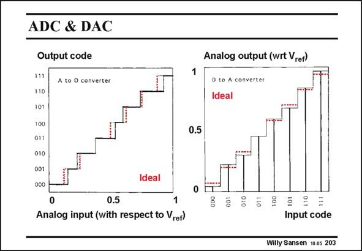

# SANSEN-203 · ADC & DAC

章节：20 CMOS 模数与数模转换原理  
PDF 页：593；书本页：604；幻灯片编号：203  
状态：unreviewed



## 对应教材讲解

### PDF 593 · 书本 604

An ADC converts a continuous input Voltage into a number of discrete steps, which are labeled by means of a digital code. The input voltage is quantized. In the example in this slide, any voltage between zero and the reference Voltage V , corresponds to ref a three-bit code. Ideally, all steps are equally wide and high. In practice however, some irregularities occur. These nonidealities will be described by specifications such as INL and DNL, as will be explained later. A DAC, on the other hand, converts a digital code into a number of voltages. This is shown in this slide for a three-bit input code. The voltages are all fractions of a reference voltage V . ref Again the steps are ideally all equal, but some non-idealities are hard to avoid in practice.

## 公式／性能结论候选摘录

以下为规则截取的原文，尚未逐项判读。

- PDF 593: Ideally, all steps are equally wide and high.
- PDF 593: The voltages are all fractions of a reference voltage V . ref Again the steps are ideally all equal, but some non-idealities are hard to avoid in practice.

## 曲线结论候选摘录

以下为规则截取的原文，尚未逐项判读。

（未由规则找到；不代表原页没有此类内容。）

## 原文条件与近似候选摘录

以下为规则截取的原文，尚未逐项判读。

（未由规则找到；不代表原页没有此类内容。）

## 幻灯片 OCR（未校正）

```text
ADC & DAC
Output code
111
A to D converter
110
101
100
011
010
001
000
Analog output (wrt Vrer)
D to A converter
Ideal
0.5
Ideal
0
0
0.5
1
Analog input (with respect to Vref)
Input code
Willy Sansen 10 0s 203
```

数学上下标、分数及正负号以原图为准。电路图已保留；未核对的连接不输出成可仿真 netlist。
