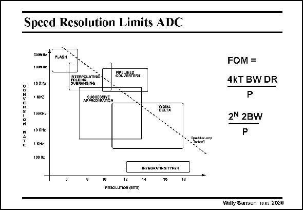

# SANSEN-2030 · Speed Resolution Limits ADC

章节：20 CMOS 模数与数模转换原理  
PDF 页：607；书本页：618；幻灯片编号：2030  
状态：unreviewed



## 对应教材讲解

### PDF 606 · 书本 617

The conversion speed is certainly the highest for flash ADCs. It is the lowest for integrating ADCs. However, the resolution of the latter ones can be much higher. Sigma-delta (or oversampling) converters can also reach high resolutions. All the others suffer from matching and are limited to 12–14 bits. Various Figures of Merit are used for the comparison of the performance. The one shown is mainly used for oversampling converters, sometimes with the peak SNR instead of the DR. Instead of this FOM the energy per conversion is quite often used or P/f . For example, a s low-power successive-approximation ADC (Scott, JSSC July 2003, 1123–1129) reaches a power consumption of 3.1 mW for a sampling frequency (or twice the BW) of 100 kHz which yields 31

### PDF 607 · 书本 618

pJoule/Sample. At this point the resolution is only 4.5 bit, however. A more often used Figure of Merit also includes P/f s (or P/2BW), but supplemented with the dynamic range 2N. For 4.5 bit, 2N is 22.6, which yields one over 1.4 pJoule/conversion. Low power ADCs presently reach values below 1 pJ/ conversion. We will start with the integrating ones.

## 公式／性能结论候选摘录

以下为规则截取的原文，尚未逐项判读。

- PDF 606: All the others suffer from matching and are limited to 12–14 bits.

## 曲线结论候选摘录

以下为规则截取的原文，尚未逐项判读。

- PDF 606: The one shown is mainly used for oversampling converters, sometimes with the peak SNR instead of the DR.

## 原文条件与近似候选摘录

以下为规则截取的原文，尚未逐项判读。

- PDF 606: For example, a s low-power successive-approximation ADC (Scott, JSSC July 2003, 1123–1129) reaches a power consumption of 3.1 mW for a sampling frequency (or twice the BW) of 100 kHz which yields 31

## 幻灯片 OCR（未校正）

```text
Speed Resolution Limits ADC
<300
БОСРИНЕ*
1UUW HEZ
10 y:te
1 MIZ
100Kk/
10 Kke
PLASH
CONVERTERS
APMIOXILATEM
HRLNA
FOM =
4KT BW DR
P
2N 2BW
P
Pser."
100 Htr
INTRORANHG TYPES
14
15
12
RESOLUTION (BITs,
Willy Sansen 1005 2030
```

数学上下标、分数及正负号以原图为准。电路图已保留；未核对的连接不输出成可仿真 netlist。
