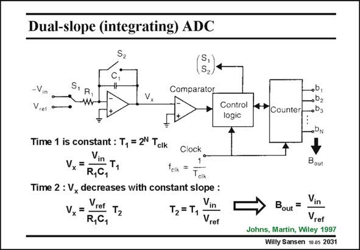

# SANSEN-2031 · Dual-slope (integrating) ADC

章节：20 CMOS 模数与数模转换原理  
PDF 页：607；书本页：618；幻灯片编号：2031  
状态：unreviewed



## 对应教材讲解

### PDF 607 · 书本 618

Integrating or dual-slope converters can reach high resolutions because matching does not come in. The same components are used by the same integrator twice. It uses two time periods T and T . The first one is 1 2 constant whereas the second depends on the input signal. During the first time T , 1 the input Voltage −V is in integrated with time constant R C during a con- 1 1 stant period T , which 1 equals 2N times the clock period T . A voltage V is reached, as is shown in the next slide. clk x During the second period T , the input Voltage V is integrated with the same time constant 2 ref R C during such a time T , that the output voltage is again zero. 1 1 2 A counter is used to measure the times T and T . It counts up during time T and down 1 2 1 during time T . 2 A simple relationship exists between the two time periods T and T , as shown in this slide 1 2 and in the next slide. This counter therefore generates the digital equivalent B . out

## 公式／性能结论候选摘录

以下为规则截取的原文，尚未逐项判读。

- PDF 607: The first one is 1 2 constant whereas the second depends on the input signal.
- PDF 607: During the first time T , 1 the input Voltage −V is in integrated with time constant R C during a con- 1 1 stant period T , which 1 equals 2N times the clock period T .
- PDF 607: This counter therefore generates the digital equivalent B . out

## 曲线结论候选摘录

以下为规则截取的原文，尚未逐项判读。

- PDF 607: Integrating or dual-slope converters can reach high resolutions because matching does not come in.

## 原文条件与近似候选摘录

以下为规则截取的原文，尚未逐项判读。

（未由规则找到；不代表原页没有此类内容。）

## 幻灯片 OCR（未校正）

```text
Dual-slope (integrating) ADC
S,
-V
R,
—w
Comparator
Vx
•b,
002
Control
logic
4* Counter,
Time 1 is constant : T, = 2N Tcik
Vx=
Vin T1
Clock
R,C,
fcik
Tclk
Time 2 : V, decreases with constant slope :
Vx=
Vret T2
Vin
T2 = T,
R,C,
Vrer
Bout
Bout
Vref
Johns, Martin, Wiley 1997
Willy Sansen 10 as 2031
```

数学上下标、分数及正负号以原图为准。电路图已保留；未核对的连接不输出成可仿真 netlist。
