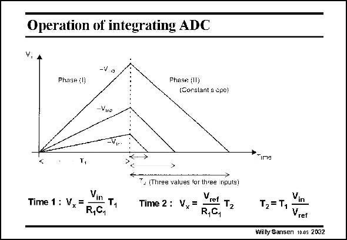

# SANSEN-2032 · Operation of integrating ADC

章节：20 CMOS 模数与数模转换原理  
PDF 页：608；书本页：619；幻灯片编号：2032  
状态：unreviewed



## 对应教材讲解

### PDF 608 · 书本 619

A counter counts up during time T and down during 1 time T . In the first time T 2 1 the slope depends on the input voltage V , whereas in during the second time T , 2 the slope is constant, such that this time T depends on 2 the input signal V . in A simple and very linear relationship exists between the two time periods T and 1 T , as shown in this slide. 2

## 公式／性能结论候选摘录

以下为规则截取的原文，尚未逐项判读。

- PDF 608: In the first time T 2 1 the slope depends on the input voltage V , whereas in during the second time T , 2 the slope is constant, such that this time T depends on 2 the input signal V . in A simple and very linear relationship exists between the two time periods T and 1 T , as shown in this slide. 2

## 曲线结论候选摘录

以下为规则截取的原文，尚未逐项判读。

- PDF 608: In the first time T 2 1 the slope depends on the input voltage V , whereas in during the second time T , 2 the slope is constant, such that this time T depends on 2 the input signal V . in A simple and very linear relationship exists between the two time periods T and 1 T , as shown in this slide. 2

## 原文条件与近似候选摘录

以下为规则截取的原文，尚未逐项判读。

（未由规则找到；不代表原页没有此类内容。）

## 幻灯片 OCR（未校正）

```text
Operation of integrating ADC
V. A
-V s
Phase :1
Phase (II)
(Constant a opo)
-Vina
-V,.
*ime
Vin
Time 1: Vx=
T,
R,C,
T. (Three values for three nputs)
Time 2: Vy=
Vrot T2
R,C1
Vin
T2 = T,
Vret
Willy Sansen 10.05 2032
```

数学上下标、分数及正负号以原图为准。电路图已保留；未核对的连接不输出成可仿真 netlist。
