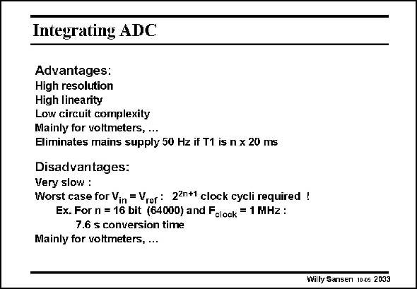

# SANSEN-2033 · Integrating ADC

章节：20 CMOS 模数与数模转换原理  
PDF 页：608；书本页：619；幻灯片编号：2033  
状态：unreviewed



## 对应教材讲解

### PDF 608 · 书本 619

Such integrating or dualslope ADC has many advantages. The result is independent of the actual values of the resistor R and capacitor 1 C . As long as the opamp 1 has sufficient gain, it does not affect the result. The linearity is high and so is the resolution. The circuitry is actually fairly simple. Only opamps are used, an RC circuit and some switches. The converter is fairly slow, however. For a large input voltage, such as V itself, the counter has to count up over 2N ref clock pulses and also down over as many pulses. The conversion time is thus quite long. For slow digital voltmeters, this is an excellent solution. This is especially true if the hum of the 50 Hz mains (60 Hz in USA) is synchronized by the clock. In this way the effect of the hum is cancelled. At the input of an oscilloscope, higher speeds are required however, and less resolution.

## 公式／性能结论候选摘录

以下为规则截取的原文，尚未逐项判读。

- PDF 608: The result is independent of the actual values of the resistor R and capacitor 1 C .
- PDF 608: As long as the opamp 1 has sufficient gain, it does not affect the result.
- PDF 608: The conversion time is thus quite long.

## 曲线结论候选摘录

以下为规则截取的原文，尚未逐项判读。

（未由规则找到；不代表原页没有此类内容。）

## 原文条件与近似候选摘录

以下为规则截取的原文，尚未逐项判读。

（未由规则找到；不代表原页没有此类内容。）

## 幻灯片 OCR（未校正）

```text
Integrating ADC
Advantages:
High resolution
High linearity
Low circuit complexity
Mainly for voltmeters, ...
Eliminates mains supply 50 Hz if T1 is n x 20 ms
Disadvantages:
Very slow :
Worst case for Vin = Vrer : 22n*1 clock cycli required !
Ex. For n = 16 bit (64000) and Fclock = 1 MHz :
7.6 s conversion time
Mainly for voltmeters, ..
Willy Sansen 10.09 2033
```

数学上下标、分数及正负号以原图为准。电路图已保留；未核对的连接不输出成可仿真 netlist。
