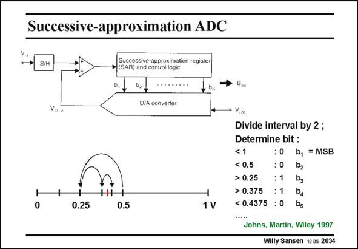

# SANSEN-2034 · Successive-approximation ADC

章节：20 CMOS 模数与数模转换原理  
PDF 页：609；书本页：620；幻灯片编号：2034  
状态：unreviewed



## 对应教材讲解

### PDF 608 · 书本 619

For such applications a SAR ADC is used. It consists of a Sample-and-hold at the input, to maintain a constant voltage during the conversion.

### PDF 609 · 书本 620

This is followed by a comparator, which generates the bits by successive approximation. The bits are fed back through a DAC to close the loop. The successive-approximation register compares the incoming voltage to the next binary value as shown in this slide. Assume that the input voltage is 0.4 V (the reference voltage is 1 V). In a first comparison 0.4 V is found to be less than 1 V. This yields a digital 0, which is the MSB. The interval is now divided by 2 and the incoming voltage is compared to 0.5 V. This again yields a digital 0. The interval is now divided by 2 and the incoming voltage is compared to 0.25 V. This now yields a digital 1. Moreover, this 1 is used as a control signal to indicate that in the next comparison the interval 0.25 to 0.375 has to be selected, not the one between 0.125 and 0.25 V. This sequence is continued for N comparisons or N bits. This successive approximation takes only N clock cycles. It is therefore much faster than an integrating ADC. It is sensitive to the offset of the comparator, however.

## 公式／性能结论候选摘录

以下为规则截取的原文，尚未逐项判读。

- PDF 609: It is therefore much faster than an integrating ADC.

## 曲线结论候选摘录

以下为规则截取的原文，尚未逐项判读。

（未由规则找到；不代表原页没有此类内容。）

## 原文条件与近似候选摘录

以下为规则截取的原文，尚未逐项判读。

- PDF 609: This is followed by a comparator, which generates the bits by successive approximation.
- PDF 609: The successive-approximation register compares the incoming voltage to the next binary value as shown in this slide.
- PDF 609: Assume that the input voltage is 0.4 V (the reference voltage is 1 V).
- PDF 609: This successive approximation takes only N clock cycles.

## 幻灯片 OCR（未校正）

```text
Successive-approximation ADC
Successive-approximation register
SAR) and control logic
ba
D/A converter
+
0.25
0.5
1V
Viet
Divide interval by 2;
Determine bit :
<1
: 0
b, = MSB
< 0.5
: 0
bz
> 0.25
:1
> 0.375 : 1
< 0.4375 : 0
Ds
Johns, Martin, Wiley 1997
Willy Sansen 10 as 2034
```

数学上下标、分数及正负号以原图为准。电路图已保留；未核对的连接不输出成可仿真 netlist。
