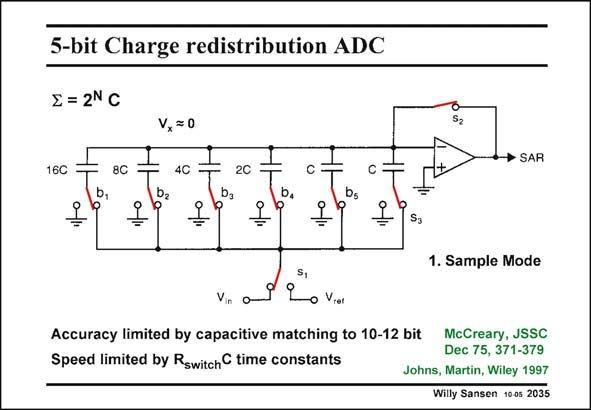

# SANSEN-2035 · 5-bit Charge redistribution ADC

章节：20 CMOS 模数与数模转换原理  
PDF 页：609；书本页：620；幻灯片编号：2035  
状态：unreviewed



## 对应教材讲解

### PDF 609 · 书本 620

As a DAC, a charge redistribution DAC is often used as shown in this slide. It consists of an opamp and a binary bank of capacitors. In this example a 5-bit capacitor bank is selected for a 5-bit AD Conversion. It uses 3 phases, i.e. the sample mode, the hold mode and the bit cycling phase. The picture is repeated three times, each time with adjusted positions of the switches. In the sample mode, all bottom plates of the capacitors are connected to the input voltage V . All top plates are connected to the virtual ground of the opamp. All capacitors thus sample in the input voltage V . in The voltage V at the input of the opamp is therefore zero and so is the output voltage. x

### PDF 610 · 书本 621

Note that such ADC is quite simple as it consists of one single opamp (comparator) and a capacitor bank and some logic. The total number of unit capacitors is only 2N. Its power consumption can be quite low, especially if only low-frequencies have to be processed (see Scott, JSSC July 2003, 1123–1129). Because of the capacitor bank, the accuracy is limited by its matching, which is 10–12 bit, depending on the sizes of the capacitors (see Chapter 15). Its speed is limited by the speed of the opamp and the RC time constants of the switches, as in any switched-capacitor system (see Chapter 17).

## 公式／性能结论候选摘录

以下为规则截取的原文，尚未逐项判读。

- PDF 609: All capacitors thus sample in the input voltage V . in The voltage V at the input of the opamp is therefore zero and so is the output voltage. x
- PDF 610: Because of the capacitor bank, the accuracy is limited by its matching, which is 10–12 bit, depending on the sizes of the capacitors (see Chapter 15).
- PDF 610: Its speed is limited by the speed of the opamp and the RC time constants of the switches, as in any switched-capacitor system (see Chapter 17).

## 曲线结论候选摘录

以下为规则截取的原文，尚未逐项判读。

- PDF 609: It uses 3 phases, i.e. the sample mode, the hold mode and the bit cycling phase.

## 原文条件与近似候选摘录

以下为规则截取的原文，尚未逐项判读。

（未由规则找到；不代表原页没有此类内容。）

## 幻灯片 OCR（未校正）

```text
5-bit Charge redistribution ADC
E = 2N C
16C
8C
V,=0
4C
S2
• SAR
2C
b,
D2
Dg
DA
S3
1. Sample Mode
S,
Vin
o Vrer
Accuracy limited by capacitive matching to 10-12 bit
McCreary, JSSC
Dec 75, 371-379
Speed limited by Rswitch C time constants
Johns, Martin, Wiley 1997
Willy Sansen 1005 2035
```

数学上下标、分数及正负号以原图为准。电路图已保留；未核对的连接不输出成可仿真 netlist。
