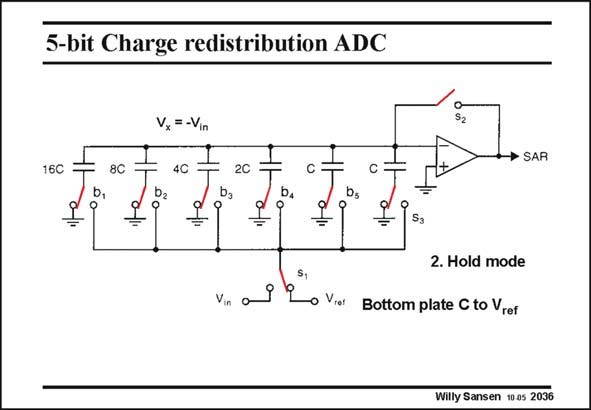

# SANSEN-2036 · 5-bit Charge redistribution ADC

章节：20 CMOS 模数与数模转换原理  
PDF 页：610；书本页：621；幻灯片编号：2036  
状态：unreviewed



## 对应教材讲解

### PDF 610 · 书本 621

In the hold mode, the feedback loop around the opamp is opened. As a result, the voltage V at the x input of the opamp can take any value. The bottom plates of the capacitors are now all connected to ground, pushing V to −V . x in At the same time, switch S1 switches in V rather ref than V . in

## 公式／性能结论候选摘录

以下为规则截取的原文，尚未逐项判读。

- PDF 610: As a result, the voltage V at the x input of the opamp can take any value.

## 曲线结论候选摘录

以下为规则截取的原文，尚未逐项判读。

（未由规则找到；不代表原页没有此类内容。）

## 原文条件与近似候选摘录

以下为规则截取的原文，尚未逐项判读。

（未由规则找到；不代表原页没有此类内容。）

## 幻灯片 OCR（未校正）

```text
5-bit Charge redistribution ADC
16C
8C
Vx= -Vin
4C
S2
→ SAR
2C
C
D2
ba
b4
bs
=
=
S3
S,
Vin
o Viet
2. Hold mode
Bottom plate C to Vrer
Willy Sansen 10 as 2036
```

数学上下标、分数及正负号以原图为准。电路图已保留；未核对的连接不输出成可仿真 netlist。
