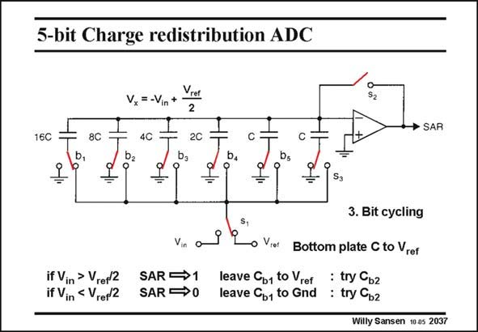

# SANSEN-2037 · 5-bit Charge redistribution ADC

章节：20 CMOS 模数与数模转换原理  
PDF 页：610；书本页：621；幻灯片编号：2037  
状态：unreviewed



## 对应教材讲解

### PDF 610 · 书本 621

The successive approximation algorithm now takes place. Each bit is now cycled through a similar comparison sequence, in order to find out the position of the input voltage on the binary scale. We start with the MSB by switching the bottom plate of the largest capacitor 16C to the reference voltage (see slide). As the sum of all other capacitors 8C, 4C, 2C, ... equals 16C, only half of the reference voltage V is added to the −V voltage. The opamp input voltage V is illustrated, as ref in x shown in this slide.

### PDF 611 · 书本 622

If the V is larger than V /2, then V is negative. In this case, the SAR register stores a in ref x digital 1; switch b remains as shown. 1 If, however, V is smaller than V /2 then V is positive. In this case the SAR register stores in ref x a digital 0; switch b is switched back; the bottom plate of capacitor 16C goes back to ground. 1 The sequence is now repeated with switch b : the bottom plate of capacitor 8C is connected 2 to V . As a result, an additional V /4 is added to V for comparison. ref ref x This sequence is continued until all capacitors have been switched in, until all bits have been cycled through.

## 公式／性能结论候选摘录

以下为规则截取的原文，尚未逐项判读。

- PDF 610: As the sum of all other capacitors 8C, 4C, 2C, ... equals 16C, only half of the reference voltage V is added to the −V voltage.
- PDF 611: As a result, an additional V /4 is added to V for comparison. ref ref x This sequence is continued until all capacitors have been switched in, until all bits have been cycled through.

## 曲线结论候选摘录

以下为规则截取的原文，尚未逐项判读。

（未由规则找到；不代表原页没有此类内容。）

## 原文条件与近似候选摘录

以下为规则截取的原文，尚未逐项判读。

- PDF 610: The successive approximation algorithm now takes place.

## 幻灯片 OCR（未校正）

```text
5-bit Charge redistribution ADC
16C
8C
Vx = -Vin
4C
S2
→ SAR
2C
C
b2
b4
bs
=
=
S3
Vin
if Vin > Vrer2 SAR →1
if Vin < Vrer2 SAR→0
3. Bit cycling
re!
Bottom plate C to Vrer
leave Co to ref : try Cb2
leave Co, to Gnd : try Cbz
Willy Sansen 10 as 2037
```

数学上下标、分数及正负号以原图为准。电路图已保留；未核对的连接不输出成可仿真 netlist。
