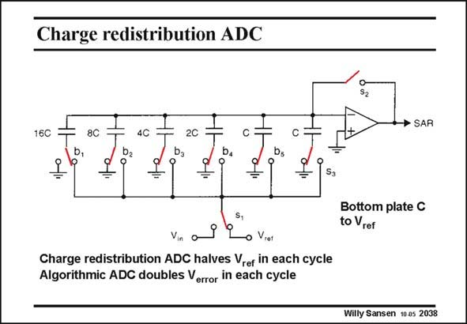

# SANSEN-2038 · Charge redistribution ADC

章节：20 CMOS 模数与数模转换原理  
PDF 页：611；书本页：622；幻灯片编号：2038  
状态：unreviewed



## 对应教材讲解

### PDF 611 · 书本 622

Note that in such charge redistribution ADC, the input voltage V is comin pared with a series of increasingly smaller fractions of V . ref This algorithm can be continued until the smallest fraction of V , which is ref V /2N has become smaller ref than the offset of the opamp, or smaller than the mismatch error on the smallest capacitors C. This limits the resolution to 10–12 bit. An alternative consists of taking at each cycle, the difference between the input voltage and the fraction of the V obtained before, and multiplying it by two, to carry out a new comparison. ref This is called an algorithmic ADC. It is discussed in more detail next.

## 公式／性能结论候选摘录

以下为规则截取的原文，尚未逐项判读。

- PDF 611: This limits the resolution to 10–12 bit.

## 曲线结论候选摘录

以下为规则截取的原文，尚未逐项判读。

（未由规则找到；不代表原页没有此类内容。）

## 原文条件与近似候选摘录

以下为规则截取的原文，尚未逐项判读。

（未由规则找到；不代表原页没有此类内容。）

## 幻灯片 OCR（未校正）

```text
Charge redistribution ADC
→ SARI
16C
8C
4C
2C
b,
ba
b,
bs
=
Sa
Bottom plate C
to Vrer
Vin
Viet
Charge redistribution ADC halves Vref in each cycle
Algorithmic ADC doubles Verror in each cycle
Willy Sansen 10 as 2038
```

数学上下标、分数及正负号以原图为准。电路图已保留；未核对的连接不输出成可仿真 netlist。
