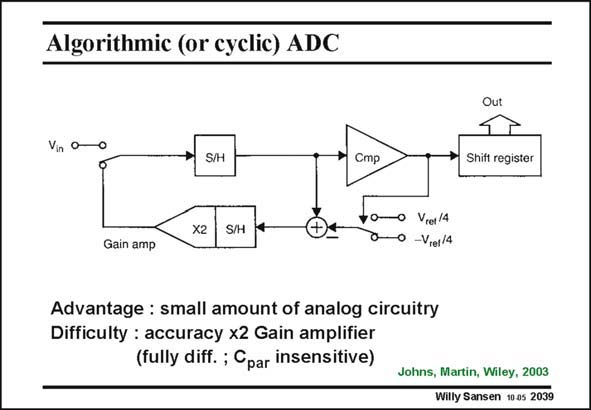

# SANSEN-2039 · Algorithmic (or cyclic) ADC

章节：20 CMOS 模数与数模转换原理  
PDF 页：611；书本页：622；幻灯片编号：2039  
状态：unreviewed



## 对应教材讲解

### PDF 611 · 书本 622

In an algorithmic ADC even less circuitry is required. It also contains a S/H as well. An amplifier with a precise amplification of two is also included. It is used to amplify the difference between the input voltage V and the fraction of the in reference voltage V /4. ref A register keeps track of the code generated by the subsequent comparisons. Since in each cycle, this difference is amplified by 2, there is now no need for a

### PDF 612 · 书本 623

binary capacitor bank or a binary set of fractions of the V . ref We assume however, that the multiplication by two has an error which is smaller than an LSB. Some examples will be given when pipeline ADCs are discussed. Normally such converters are all realized in a fully-differential way, in order to improve the accuracy.

## 公式／性能结论候选摘录

以下为规则截取的原文，尚未逐项判读。

（未由规则找到；不代表原页没有此类内容。）

## 曲线结论候选摘录

以下为规则截取的原文，尚未逐项判读。

（未由规则找到；不代表原页没有此类内容。）

## 原文条件与近似候选摘录

以下为规则截取的原文，尚未逐项判读。

- PDF 612: binary capacitor bank or a binary set of fractions of the V . ref We assume however, that the multiplication by two has an error which is smaller than an LSB.

## 幻灯片 OCR（未校正）

```text
Algorithmic (or cyclic) ADC
Out
Vin o
S/H
Cmp
Shift register
Gain amp
X2
S/H
0 Vret/4
-Vret/4
Advantage : small amount of analog circuitry
Difficulty : accuracy x2 Gain amplifier
(fully diff. ; Cpar insensitive)
Johns, Martin, Wiley, 2003
Willy Sansen 10as 2039
```

数学上下标、分数及正负号以原图为准。电路图已保留；未核对的连接不输出成可仿真 netlist。
